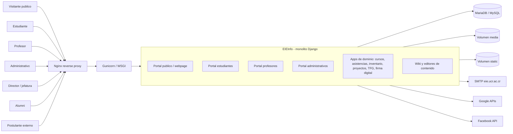
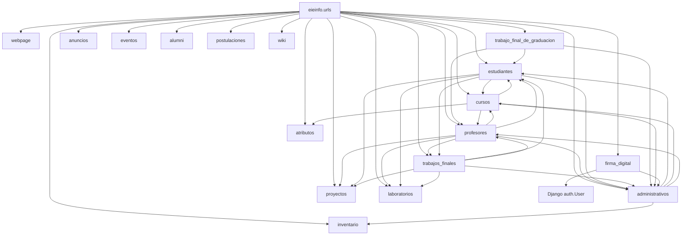

# Auditoria de diseno de software del sistema EIEInfo

## Entrega 1: Levantamiento del sistema y diagnostico inicial

**Curso:** IE-0417 - Diseno de Software para Ingenieria  
**Sistema auditado:** EIEInfo, sistema de informacion de la Escuela de Ingenieria Electrica  
**Repositorio base:** `EIEInfo/`  
**Carpeta de trabajo:** `IE-0417/Proyecto/`  
**Fecha:** Junio de 2026

---

## 1. Proposito y alcance

Esta entrega responde la pregunta central de la semana 1: **que sistema tenemos enfrente y cuales son sus principales rasgos de diseno**. El analisis se basa en evidencia observable del repositorio, no en la instalacion del sistema.

El levantamiento cubre:

- ficha tecnica del sistema;
- mapa general de arquitectura y modulos;
- inventario funcional;
- hallazgos iniciales con evidencia;
- matriz preliminar de riesgos.

## 2. Ficha tecnica del sistema

| Dimension | Diagnostico inicial | Evidencia |
|---|---|---|
| Tipo de sistema | Sistema web institucional para la Escuela de Ingenieria Electrica, con portal publico y portales autenticados. | `README.md`; `src/server/eieinfo/urls.py` |
| Arquitectura predominante | Monolito modular Django: muchas apps comparten un mismo proceso, base de datos y configuracion global. | `docker/django/settings.py:44-94`; `src/server/eieinfo/urls.py:23-68` |
| Lenguaje y framework | Python + Django. El `requirements.txt` declara `Django==4.1.3`, aunque comentarios heredados aun mencionan Django 1.9.1. | `requirements.txt`; `docker/django/settings.py:1-16`; `README.md` |
| Servidor de aplicacion | Gunicorn ejecutando `eieinfo.wsgi`. | `docker-compose.yml:62-67`; `conf/etc/systemd/system/eieinfo.service` |
| Proxy / servidor web | Nginx como reverse proxy, servidor de estaticos/media y terminacion TLS en produccion. | `conf/etc/nginx/sites-available/eieinfo` |
| Base de datos esperada | MySQL/MariaDB. La imagen Docker usa MariaDB y las credenciales de prueba apuntan a `django.db.backends.mysql`. | `docker-compose.yml:6-28`; `docker/django/secret_credentials.py:11-23` |
| Dependencias relevantes | Wiki, Martor, CKEditor, django-recaptcha, django-crontab, Google/Facebook APIs, mysqlclient, Gunicorn, PyPDF2, XlsxWriter, django-polymorphic. | `requirements.txt` |
| Despliegue observable | Dos estrategias conviven: despliegue historico en Faraday con systemd/Nginx/socket Unix y version Docker Compose con DB, Nginx y app. | `README.md`; `docker-compose.yml`; `conf/etc/systemd/system/eieinfo.service` |
| CI/CD observable | Drone construye contenedores, levanta servicios, prueba endpoints y ejecuta pruebas unitarias. | `.drone.yml` |
| Integraciones externas visibles | SMTP institucional, Google Custom Search/Calendar, Facebook, reCAPTCHA, Let's Encrypt, Imgur/Martor, Firmador Libre por puerto local. | `README.md`; `docker/django/settings.py:349-478`; `firma_digital/models.py:17-22` |
| Almacenamiento de archivos | `/var/info/media`, `/var/info/static`, `/var/info/logs`; en Docker se comparten como volumenes. | `docker/django/settings.py:327-343`; `docker-compose.yml:43-45` |

### Lectura tecnica

EIEInfo no es una aplicacion pequena de catalogo; es un sistema institucional amplio con dominio academico-administrativo. El repositorio contiene 242 archivos Python bajo `src/server` si se excluyen migraciones y estaticos, con unas 43 777 lineas Python. El nucleo arquitectonico es Django: `INSTALLED_APPS` registra portales y dominios como `estudiantes`, `profesores`, `administrativos`, `cursos`, `inventario`, `trabajos_finales`, `trabajo_final_de_graduacion`, `firma_digital`, `postulaciones` y `webpage`.

## 3. Mapa general del sistema

### 3.1 Diagrama de contexto

### 3.2 Diagrama de modulos y dependencias principales

### 3.3 Puntos de entrada importantes

El enrutador principal `src/server/eieinfo/urls.py` concentra los portales y dominios del sistema:

- `/` y paginas publicas: `webpage.urls`;
- `/estudiantes/`: portal de estudiantes;
- `/profesores/`: portal de profesores;
- `/administrativos/`: portal administrativo;
- `/cursos/`, `/proyectos/`, `/laboratorios/`, `/trabajos_finales/`, `/trabajo_final_de_graduacion/`;
- `/inventario/`, `/postulaciones/`, `/alumni/`, `/firma_digital/`;
- `/wiki/`, `/martor/`, `/.well-known/` y `/admin/`.

La aplicacion Django se expone con Gunicorn y Nginx. En Docker, el contenedor `nginx` publica el puerto `8080:80`, el contenedor `eieinfo_app` publica `8001` y ejecuta migraciones antes de iniciar Gunicorn. En produccion historica, Nginx redirige a un socket Unix `/run/eieinfo.sock`.

## 4. Inventario funcional

### 4.1 Actores visibles

| Actor | Evidencia | Capacidades visibles |
|---|---|---|
| Visitante publico | `webpage/urls.py`; `webpage/views.py` | Consulta de informacion institucional, personal, publicaciones, proyectos, laboratorios, estudios, contacto, recursos y paginas estaticas. |
| Estudiante | `estudiantes/urls.py`; `estudiantes/models.py` | Perfil, cursos, asistencias, tramites, proyecto electrico, bodega, practica profesional, requisitos de graduacion. |
| Profesor | `profesores/urls.py`; `profesores/views/*` | Perfil, cursos, asistencias, consejo asesor, comisiones, laboratorios, proyectos, publicaciones, noticias, proyecto electrico. |
| Administrativo | `administrativos/urls.py`; `administrativos/views/*` | Gestion de estudiantes, noticias, inventario, reservaciones, practica profesional, asistencias, consejo asesor. |
| Director / jefatura / comisiones | `administrativos.models`, `profesores.misc`, `firma_digital.views` | Aprobaciones, nombramientos, notificaciones, firma digital, consejo asesor y comisiones. |
| Alumni | `alumni/urls.py`; `alumni/models.py` | Perfil de egresado y ofertas de empleo. |
| Postulante externo | `postulaciones/models.py`; `webpage/urls.py` | Formulario de postulacion y seguimiento administrativo del estado. |
| Administrador Django | `src/server/eieinfo/urls.py:25-27` | Administracion interna y documentacion automatica del admin. |

### 4.2 Areas funcionales principales

| Area | Apps relacionadas | Observacion inicial |
|---|---|---|
| Portal institucional publico | `webpage`, `anuncios`, `eventos`, `proyectos`, `laboratorios`, `cursos` | Capa de consulta y contenido, con mucha dependencia de modelos de dominio. |
| Gestion academica | `cursos`, `estudiantes`, `profesores`, `atributos` | Cursos, grupos, planes de estudio, rubricas y relacion con estudiantes/profesores. |
| Gestion administrativa | `administrativos`, `inventario`, `laboratorios`, `proyectos` | Funcionario, roles, lugares, horarios, ciclos, nombramientos, comisiones y bienes. |
| Asistencias y practica profesional | `estudiantes`, `profesores`, `administrativos` | Flujos transversales con aprobacion y seguimiento por varios actores. |
| Trabajos finales y proyectos electricos | `trabajos_finales`, `trabajo_final_de_graduacion`, `profesores`, `estudiantes` | Hay dos generaciones de funcionalidad: proyecto electrico legado y TFG nuevo. |
| Firma digital | `firma_digital`, `administrativos`, `auth.User` | Carga, revision, firma y descarga de documentos PDF con notificaciones. |
| Alumni y empleo | `alumni`, `profesores`, `estudiantes` | Ofertas laborales y perfiles de egresados. |
| Postulaciones | `postulaciones`, `webpage` | Captura de postulaciones externas y comentarios/estado. |
| Wiki / contenidos enriquecidos | `wiki`, `martor`, `ckeditor`, `webpage` | Edicion de contenido, archivos y paginas estaticas. |

### 4.3 Flujos visibles mas importantes

1. **Acceso publico a informacion institucional:** Nginx -> Gunicorn -> `webpage.urls` -> modelos de publicaciones, cursos, proyectos, laboratorios, funcionarios y textos.
2. **Autenticacion y perfil de funcionarios:** rutas de `profesores`, `administrativos` y recuperacion/cambio de contrasena desde `webpage.urls`.
3. **Gestion de cursos y ciclos:** `cursos.models` relaciona cursos, catedras, grupos, profesores, horarios, plan de estudio y ciclos.
4. **Asistencias estudiantiles:** `estudiantes.models` define asistencia, tipos de asistencia, concurso, horas realizadas y asociaciones con cursos, laboratorios, comisiones o proyectos.
5. **Consejo asesor y nombramientos:** `profesores/views/consejo_asesor.py` coordina profesores, administrativos, cursos, laboratorios, proyectos, asistencias, nombramientos y reportes.
6. **Proyecto electrico / trabajos finales:** `trabajos_finales.models` gestiona estados, concursos, avances, lectores, clasificacion y relacion con estudiantes/profesores.
7. **TFG nuevo:** `trabajo_final_de_graduacion.models` modela defensa, comite asesor, TFG, concurso, revisiones y documentos complementarios.
8. **Firma digital:** `firma_digital.urls` expone solicitudes, carga de PDF, APIs AJAX, descarga y guardado de documentos firmados; los modelos almacenan binarios en BD.
9. **CI operacional:** Drone levanta contenedores, prueba URLs publicas/autenticadas y genera fixtures para pruebas.

### 4.4 Modulos criticos para la operacion

- `eieinfo`: configuracion global, rutas raiz, WSGI, settings.
- `administrativos`: roles, funcionarios, lugares, ciclos, nombramientos, comisiones; muchas apps dependen de este modulo.
- `profesores`: portal de profesores y gran parte de la logica de consejo asesor.
- `estudiantes`: identidad estudiantil, asistencias, practica profesional y requisitos.
- `cursos`: cursos, grupos, catedras, horarios y planes de estudio.
- `webpage`: portal publico y contenidos institucionales.
- `trabajos_finales` y `trabajo_final_de_graduacion`: procesos academicos sensibles y de larga duracion.
- `firma_digital`: documentos, aprobaciones y notificaciones.
- `docker` / `.drone.yml`: operacion, despliegue y pruebas automatizadas.

## 5. Hallazgos iniciales

### H-01. Monolito modular con alta concentracion de responsabilidades

**Criticidad:** Alta  
**Descripcion:** El sistema esta organizado en apps Django, pero todas conviven en un mismo proceso, settings, base de datos y archivo de rutas raiz. El monolito es razonable para el contexto, pero algunas apps funcionan como nucleos compartidos y aumentan el costo de cambio.  
**Evidencia:** `docker/django/settings.py:44-94` registra mas de 15 apps internas; `src/server/eieinfo/urls.py:23-68` enruta casi todos los dominios desde una sola raiz.  
**Impacto:** Cambios en configuracion, modelos base o rutas pueden afectar varios portales al mismo tiempo. Requiere disciplina de pruebas y limites modulares.

### H-02. `administrativos` actua como modulo central de dominio

**Criticidad:** Alta  
**Descripcion:** Muchos conceptos transversales viven en `administrativos`: funcionarios, ciclos, lugares, horarios, roles, nombramientos, jefaturas y comisiones. Otras apps importan estos modelos de forma directa.  
**Evidencia:** `administrativos/models.py` define 17 clases de dominio; `estudiantes/models.py:14-18`, `cursos/models.py`, `trabajos_finales/models.py:7-12` y `profesores/views/consejo_asesor.py:9-21` dependen de esos conceptos.  
**Impacto:** `administrativos` concentra decisiones de dominio que no son exclusivamente administrativas. Esto puede generar acoplamiento conceptual y dificultar cambios en ciclos, roles o funcionarios.

### H-03. Configuracion sensible y credenciales visibles en el repositorio

**Criticidad:** Alta  
**Descripcion:** Hay claves, contrasenas y valores sensibles o simulados en archivos versionados de Docker/settings. Aunque algunas parezcan de desarrollo, el patron de exposicion es riesgoso.  
**Evidencia:** `docker/django/secret_credentials.py:5`, `:15`, `:33`, `:50-62`; `docker-compose.yml:14-19`; `docker/django/settings.py:349-353`.  
**Impacto:** Aumenta el riesgo de filtracion, reutilizacion accidental de secretos y configuraciones inseguras en ambientes no controlados.

### H-04. Separacion de ambientes dependiente del hostname

**Criticidad:** Alta  
**Descripcion:** El settings arranca con `DEBUG = True`, lo cual es razonable para ejecutar el sistema localmente sin hacer un despliegue completo. El punto debil no es el modo debug local en si, sino que el cambio a configuracion de produccion depende de que el hostname sea exactamente `faraday`; fuera de ese hostname se asigna `ALLOWED_HOSTS = ['*']`.  
**Evidencia:** `docker/django/settings.py:36`; `docker/django/settings.py:487-497`.  
**Impacto:** La seguridad del ambiente depende de una convencion operacional fragil. Si en el futuro se despliega en otro servidor o se clona el ambiente de produccion con otro nombre, podria quedar una configuracion mas permisiva de lo esperado. La recomendacion no es eliminar `DEBUG=True` para desarrollo, sino separar explicitamente settings de desarrollo y produccion mediante variables de entorno o archivos de configuracion diferenciados.

### H-05. Algunos archivos concentran mucha logica y acoplamiento

**Criticidad:** Alta  
**Descripcion:** Hay archivos muy grandes y con muchas importaciones cruzadas. `profesores/views/consejo_asesor.py` tiene 1810 lineas y coordina modelos/formularios/reportes de multiples dominios.  
**Evidencia:** conteo de lineas: `profesores/views/consejo_asesor.py` 1810; imports cruzados en `profesores/views/consejo_asesor.py:9-52`.  
**Impacto:** Mayor probabilidad de regresiones, dificultad de pruebas unitarias y alto costo para extraer o modificar flujos del consejo asesor.

### H-06. Hay senales de funcionalidad legada coexistiendo con funcionalidad nueva

**Criticidad:** Media  
**Descripcion:** `trabajos_finales/models.py` conserva bloques comentados de TFG antiguo, mientras existe la app nueva `trabajo_final_de_graduacion`.  
**Evidencia:** `trabajos_finales/models.py:48-90` y multiples bloques comentados posteriores; `trabajo_final_de_graduacion/models.py` define TFG, comite, defensa y revisiones.  
**Impacto:** La coexistencia puede confundir responsabilidades, rutas, permisos y lenguaje de dominio. Incrementa la deuda conceptual.

### H-07. Uso de cuentas/autenticacion propias junto con `django.contrib.auth`

**Criticidad:** Media  
**Descripcion:** Estudiantes y funcionarios tienen modelos propios con contrasenas o usuarios relacionados, mientras `firma_digital` usa `django.contrib.auth.models.User`.  
**Evidencia:** `estudiantes/models.py:109-179` incluye `contraseña` y `SetPassword`; `administrativos/models.py` relaciona `Funcionario` con `User`; `firma_digital/models.py:87-101` usa `User`.  
**Impacto:** Puede haber fragmentacion de identidad, permisos y recuperacion de contrasena. Es un riesgo de seguridad y mantenibilidad si no hay una politica clara.

## 6. Matriz preliminar de riesgos

| Riesgo | Posible causa | Impacto | Probabilidad | Prioridad preliminar |
|---|---|---:|---:|---:|
| Exposicion de secretos versionados | Credenciales y llaves presentes en archivos de configuracion versionados | Alto | Media | Alta |
| Configuracion permisiva en una migracion futura de servidor | Separacion de ambientes dependiente del hostname; `ALLOWED_HOSTS=['*']` fuera de Faraday | Alto | Media | Alta |
| Regresiones por acoplamiento entre dominios | Imports directos entre `administrativos`, `profesores`, `estudiantes`, `cursos`, `trabajos_finales` | Alto | Alta | Alta |
| Baja testabilidad de flujos complejos | Vistas grandes, mucha logica en archivos como `consejo_asesor.py` | Alto | Media | Alta |
| Ambiguedad de dominio TFG/proyecto electrico | Bloques legados en `trabajos_finales` y app nueva `trabajo_final_de_graduacion` | Medio | Alta | Media |
| Fragmentacion de autenticacion | Modelos propios de contrasena y uso parcial de `auth.User` | Alto | Media | Alta |
| Dependencias externas o legadas dificultan actualizacion | Librerias Git directas y paquetes antiguos como flake8 3.5.0, oauth2client 3.0.0, PyPDF2 1.26.0 | Medio | Media | Media |
| Fallas de operacion por configuracion dispersa | Settings, README, Docker, systemd, Nginx y secretos separados | Medio | Alta | Alta |

## 7. Diagnostico inicial

EIEInfo es un monolito Django institucional con una organizacion modular visible, pero con acoplamiento fuerte entre apps de dominio. La arquitectura actual parece haber crecido organicamente alrededor de portales por actor: publico, estudiantes, profesores y administrativos. Esa decision facilita orientar la navegacion y los permisos por usuario, pero tambien mezcla responsabilidades cuando un flujo necesita coordinar cursos, ciclos, comisiones, proyectos, asistencias e inventario.

La fortaleza principal es que el repositorio si contiene senales de operacion real: Docker Compose, Nginx, Gunicorn, systemd, Drone, pruebas, volumenes, logs, settings de produccion/desarrollo y rutas de muchos flujos. Tambien hay una inversion importante en modelos de dominio y en pruebas para algunos modulos.

El principal riesgo inicial es de gobernanza tecnica: configuracion sensible versionada y reglas de produccion dependientes del hostname. El segundo riesgo es de evolucion: los modulos centrales (`administrativos`, `profesores`, `estudiantes`, `cursos`) se importan entre si y algunos archivos concentran demasiada logica.

## 8. Conclusiones de la entrega 1

1. EIEInfo debe tratarse como un sistema institucional heredado, no como una app Django simple. Tiene dominio academico, administrativo, documental y publico.
2. La arquitectura predominante es un monolito Django modularizado por apps, con base de datos relacional y despliegue Nginx/Gunicorn.
3. Los modulos mas criticos para entender el sistema son `administrativos`, `profesores`, `estudiantes`, `cursos`, `webpage`, `trabajos_finales`, `trabajo_final_de_graduacion` y `firma_digital`.
4. Las primeras prioridades tecnicas deberian ser seguridad de configuracion, estabilizacion de ambientes/migraciones y reduccion gradual del acoplamiento en flujos de alta responsabilidad.

## 9. Anexos

### Archivos de diagrama

- `docs/diagramas/contexto-eieinfo.mmd`
- `docs/diagramas/modulos-eieinfo.mmd`

### Evidencia consultada

- `EIEInfo/README.md`
- `EIEInfo/requirements.txt`
- `EIEInfo/docker-compose.yml`
- `EIEInfo/.drone.yml`
- `EIEInfo/docker/django/settings.py`
- `EIEInfo/docker/django/secret_credentials.py`
- `EIEInfo/docker/django/Dockerfile`
- `EIEInfo/conf/etc/nginx/sites-available/eieinfo`
- `EIEInfo/conf/etc/systemd/system/eieinfo.service`
- `EIEInfo/src/server/eieinfo/urls.py`
- `EIEInfo/src/server/profesores/urls.py`
- `EIEInfo/src/server/estudiantes/urls.py`
- `EIEInfo/src/server/administrativos/urls.py`
- `EIEInfo/src/server/webpage/urls.py`
- `EIEInfo/src/server/firma_digital/urls.py`
- `EIEInfo/src/server/*/models.py`
- `EIEInfo/src/server/profesores/views/consejo_asesor.py`
