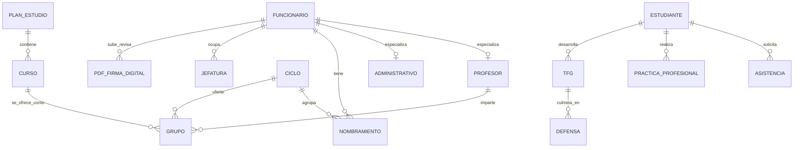

# Entrega 2 - Auditoria profunda de diseno, calidad y riesgos

Sistema auditado: EIEInfo  
Curso: IE-0417 - Diseno de software  
Base de analisis: repositorio `EIEInfo`, especialmente `src/server`, `docker`, `docker-compose.yml`, `.drone.yml`, `requirements.txt` y configuracion Django.

## 1. Proposito

Esta entrega responde la pregunta guia de la auditoria:

> Cuales son los principales problemas de diseno del sistema, por que importan y como se relacionan entre si?

El analisis se concentra en la arquitectura real observada en el codigo. EIEInfo se comporta como un monolito Django organizado por aplicaciones internas: `estudiantes`, `profesores`, `administrativos`, `cursos`, `trabajos_finales`, `trabajo_final_de_graduacion`, `firma_digital`, `inventario`, `webpage`, entre otras. La separacion en apps ayuda a ubicar funcionalidad, pero no siempre implica separacion fuerte de responsabilidades, porque muchas reglas de negocio cruzan de un modulo a otro.

## 2. Resumen ejecutivo

EIEInfo tiene una base funcional amplia y coherente con una organizacion academica: maneja estudiantes, profesores, administrativos, cursos, horarios, nombramientos, asistencias, trabajos finales, proyectos, laboratorios, documentos y paginas publicas. La mayor fortaleza arquitectonica es que el sistema ya esta dividido en aplicaciones Django reconocibles, con rutas explicitas y modelos de dominio ricos.

El principal riesgo de diseno no es que sea un monolito. Para una organizacion pequena o mediana, un monolito puede ser adecuado. El riesgo aparece porque varios modulos dependen directamente de modelos, formularios, vistas y reglas internas de otros modulos. Esto aumenta el costo de cambio: modificar una entidad central como `Funcionario`, `Ciclo`, `Profesor`, `Estudiante` o `Grupo` puede afectar varias funcionalidades a la vez.

Los problemas mas relevantes se relacionan entre si de esta forma: el dominio esta concentrado en algunos modelos grandes; esos modelos son importados por muchas apps; algunas vistas y formularios concentran reglas de negocio; la autenticacion combina sesiones propias con `django.contrib.auth`; y la configuracion operacional contiene secretos y decisiones sensibles dentro del repositorio. En conjunto, estos aspectos reducen mantenibilidad, testabilidad, modificabilidad y seguridad basica.

## 3. Evaluacion por atributos de calidad

| Atributo | Fortalezas observadas | Debilidades observadas | Evidencia concreta | Modulos ilustrativos |
|---|---|---|---|---|
| Mantenibilidad | Hay apps Django por area funcional y nombres de dominio reconocibles. | Algunos archivos concentran demasiada logica y demasiadas responsabilidades. | `profesores/views/consejo_asesor.py` tiene 1810 lineas; `estudiantes/models.py` 1348; `trabajos_finales/models.py` 1313; `administrativos/models.py` 1179. | `profesores`, `estudiantes`, `trabajos_finales`, `administrativos`. |
| Modificabilidad | Las rutas principales estan centralizadas y permiten ubicar portales por URL. | Cambios en entidades compartidas pueden propagarse a muchos modulos. | `eieinfo/urls.py:23-68` incluye muchas apps internas; `profesores/views/consejo_asesor.py` importa modelos de `administrativos`, `estudiantes`, `profesores`, `laboratorios`, `proyectos` y `cursos`. | `eieinfo`, `profesores`, `administrativos`, `cursos`. |
| Cohesion | Varias apps tienen responsabilidades nominales claras: estudiantes, profesores, cursos, firma digital, TFG. | Hay responsabilidades transversales mezcladas: administracion academica, horarios, nombramientos, comisiones y lugares se concentran en `administrativos`. | `administrativos/models.py` define constantes institucionales, lugares, ciclos, funcionarios, nombramientos, jefaturas, horarios, comisiones y presupuestos. | `administrativos`. |
| Acoplamiento | El uso de ORM permite relaciones explicitas entre entidades. | Hay importaciones directas entre apps y dependencias cruzadas frecuentes. | `cursos/models.py` importa `Horario`, `DEPARTAMENTOS`, `Lugar`, `Ciclo` y `Profesor`; `trabajos_finales/models.py` importa `Estudiante`, `Profesor`, `Ciclo`, `Nombramiento`, `Proyecto`, `Laboratorio`. | `cursos`, `trabajos_finales`, `estudiantes`, `profesores`. |
| Testabilidad | Existen pruebas relevantes y archivos de prueba grandes. | La logica concentrada en vistas/forms y el acoplamiento entre apps dificultan pruebas unitarias aisladas. | `firma_digital/tests.py` tiene 2348 lineas; `profesores/tests.py` 1607; `administrativos/tests.py` 935. Tambien hay reglas de negocio en formularios de login y vistas del consejo asesor. | `firma_digital`, `profesores`, `administrativos`, `estudiantes`. |
| Seguridad basica | Se usa hashing de contrasenas y Django auth para funcionarios/profesores. | Hay secretos versionados y autenticacion no uniforme para todos los tipos de usuario. | `secret_credentials.py:5`, `:15-17`, `:31-33`, `:50-62`; `estudiantes/forms.py` maneja sesion manual, mientras `profesores/forms.py` usa `django_login` y tambien variables de sesion. | `docker/django`, `estudiantes`, `profesores`, `administrativos`. |
| Consistencia arquitectonica | El sistema sigue el patron general de Django: modelos, forms, views, urls, settings. | Coexisten convenciones historicas y actuales; hay referencias documentales antiguas. | `README.md` indica Django 1.9.1, `requirements.txt` fija Django 4.1.3, y `eieinfo/urls.py` conserva comentario de documentacion Django 1.9. | `README`, `requirements`, `eieinfo`. |
| Observabilidad operativa | Hay logger en algunas vistas y cronjobs declarados. | No se observa una estrategia uniforme de metricas, trazas, salud del servicio o auditoria operacional. | `settings.py:475-478` define cronjobs; `profesores/views/consejo_asesor.py` crea logger, pero el patron no se aprecia como politica global. | `settings`, `profesores`, `firma_digital`, `alumni`. |

## 4. Auditoria modular

### 4.1 `administrativos`

Responsabilidad principal: representar personal administrativo, funcionarios, jefaturas, ciclos, horarios, lugares, nombramientos, comisiones, presupuestos y reglas administrativas.

Responsabilidades reales observadas: funciona como nucleo del dominio institucional. No solo modela administrativos; tambien contiene conceptos que otros modulos necesitan para operar: `Ciclo`, `Lugar`, `Horario`, `Funcionario`, `Nombramiento`, `Jefatura`, `Comision`, `Roles` y constantes institucionales.

Dependencias relevantes: es importado por `profesores`, `estudiantes`, `cursos`, `proyectos`, `inventario`, `firma_digital`, `webpage`, `trabajos_finales` y `trabajo_final_de_graduacion`.

Fortalezas: centraliza conceptos compartidos y evita duplicar definiciones institucionales basicas. La herencia `Funcionario -> Profesor/Administrativo` permite tratar profesores y administrativos como tipos relacionados.

Debilidades: el modulo tiene una responsabilidad demasiado amplia. Si cambia la definicion de `Ciclo`, `Horario`, `Funcionario` o `Nombramiento`, el impacto puede alcanzar muchas funcionalidades.

Riesgo de cambio: alto. Un cambio pequeno en el modelo central puede romper consultas, formularios, permisos o reportes en varios portales.

Recomendacion puntual: separar progresivamente conceptos transversales en un modulo de dominio compartido, por ejemplo `academico` o `core_academico`, y dejar `administrativos` para casos propios del personal administrativo.

### 4.2 `profesores` y Consejo Asesor

Responsabilidad principal: manejar profesores, login de profesores, contexto de profesor, funcionalidades del consejo asesor y tareas academicas asociadas.

Responsabilidades reales observadas: ademas de gestionar profesores, contiene flujos de cursos, horarios, aulas, nombramientos, asistencias, comisiones, proyectos y reportes. El archivo `profesores/views/consejo_asesor.py` concentra una parte muy amplia de esa operacion.

Dependencias relevantes: importa modelos y formularios de `administrativos`, `estudiantes`, `cursos`, `proyectos`, `laboratorios` y `profesores`.

Fortalezas: el modulo agrupa operaciones reales del consejo asesor en un lugar conocido y funcional.

Debilidades: el archivo de vistas del consejo asesor tiene 1810 lineas y mezcla navegacion, validacion, reglas de negocio, consultas, mensajes, reportes y redirecciones.

Riesgo de cambio: alto. Cambiar horarios, aulas, nombramientos o permisos del consejo asesor puede requerir entender un archivo extenso y varias dependencias cruzadas.

Recomendacion puntual: extraer servicios o casos de uso para operaciones complejas: asignacion de horarios, validacion de colisiones, gestion de nombramientos y reportes.

### 4.3 `estudiantes`

Responsabilidad principal: gestionar datos, login, tramites, asistencias, practica profesional, requisitos y funcionalidades del portal estudiantil.

Responsabilidades reales observadas: el modulo incluye identidad estudiantil, requisitos de graduacion, asistencias, practica profesional, formularios, vistas por subarea y reportes.

Dependencias relevantes: importa `Funcionario`, `Ciclo`, `Encargado`, `Roles`, `Comision`, `PlanDeEstudio`, `Grupo`, `PlantillaCurso`, `Laboratorio` y `Proyecto`.

Fortalezas: contiene un modelo rico del estudiante y de procesos academicos reales.

Debilidades: el modelo de estudiante y sus procesos asociados crecen dentro de un mismo modulo. La autenticacion de estudiantes se maneja con variables de sesion propias y no se integra igual que profesores/administrativos con `django.contrib.auth.User`.

Riesgo de cambio: medio-alto. Cambios en identidad, permisos o sesiones pueden requerir modificar flujo de login, decoradores, formularios y vistas.

Recomendacion puntual: definir una estrategia comun de identidad para todos los usuarios y aislar procesos estudiantiles complejos en servicios o submodulos.

### 4.4 `cursos`

Responsabilidad principal: modelar cursos, grupos, planes de estudio, catedras y horarios academicos.

Responsabilidades reales observadas: conecta cursos con profesores, horarios, lugares, ciclos, planes de estudio y funciones docentes.

Dependencias relevantes: depende de `administrativos` para `Horario`, `Lugar`, `Ciclo` y `DEPARTAMENTOS`; y de `profesores` para `Profesor`.

Fortalezas: representa una parte central del dominio academico y permite enlazar oferta academica con docentes y espacios.

Debilidades: no es un modulo aislado; su operacion depende de entidades administrativas y docentes. Esto es natural en el dominio, pero el acoplamiento directo limita modificaciones independientes.

Riesgo de cambio: medio-alto. Cambios en horarios, lugares o profesores afectan cursos y tambien consejo asesor.

Recomendacion puntual: declarar interfaces de dominio mas claras para operaciones de oferta academica, por ejemplo servicios para consulta de ciclo, asignacion de profesor y validacion de horario.

### 4.5 `trabajos_finales` y `trabajo_final_de_graduacion`

Responsabilidad principal: gestionar procesos de trabajos finales, proyecto electrico y TFG.

Responsabilidades reales observadas: coexisten dos areas relacionadas: `trabajos_finales` conserva el proceso de proyecto electrico y logica historica; `trabajo_final_de_graduacion` modela TFG, defensa, comite asesor, revisiones y documentos complementarios.

Dependencias relevantes: ambas areas dependen de `Estudiante`, `Profesor` y `Ciclo`; `trabajos_finales` tambien depende de `Nombramiento`, `Proyecto` y `Laboratorio`.

Fortalezas: el dominio esta explicitado con entidades propias y estados del proceso.

Debilidades: la coexistencia de dos modulos cercanos puede crear ambiguedad conceptual: que pertenece a proyecto electrico, que pertenece a TFG y que reglas se comparten.

Riesgo de cambio: medio. Cambios curriculares o administrativos pueden requerir revisar ambos modulos.

Recomendacion puntual: documentar una frontera clara entre proyecto electrico y TFG, y mover reglas compartidas a un servicio o modulo comun.

### 4.6 `firma_digital`

Responsabilidad principal: gestionar documentos PDF, revision, firmas, preferencias y notificaciones relacionadas con firma digital.

Responsabilidades reales observadas: integra usuarios Django, funcionarios, profesores, jefaturas, documentos, cronjobs y pruebas extensas.

Dependencias relevantes: depende de `administrativos`, `profesores`, `django.contrib.auth.User` y configuracion de cronjobs.

Fortalezas: tiene pruebas importantes y un dominio relativamente especializado.

Debilidades: al depender de perfiles institucionales y permisos de jefatura, queda acoplado a decisiones de identidad y roles de otros modulos.

Riesgo de cambio: medio. Cambios en roles, jefaturas o autenticacion pueden afectar firma digital.

Recomendacion puntual: encapsular reglas de autorizacion de firma en funciones o servicios pequenos y probados, para no depender directamente de detalles internos de otros modulos.

## 5. Auditoria del dominio

Las entidades principales del dominio son:

- Personas y cuentas: `Funcionario`, `Profesor`, `Administrativo`, `Estudiante`, `User`.
- Estructura academica: `Ciclo`, `Curso`, `Grupo`, `Catedra`, `PlanDeEstudio`, `Horario`, `Lugar`.
- Gestion institucional: `Nombramiento`, `Jefatura`, `Comision`, `Roles`, `PresupuestoCiclo`.
- Procesos estudiantiles: `Asistencia`, `PracticaProfesional`, `RequisitosBachillerato`, `RequisitosLicenciatura`.
- Trabajos finales: `ProyectoElectrico`, `ConcursoProyectoElectrico`, `Avance`, `TFG`, `Defensa`, `ComiteAsesor`, `RevisionRevisor`.
- Extension/documentos: `Proyecto`, `Laboratorio`, `PDF`, `SignedPDF`, noticias y pagina publica.

Diagrama de dominio simplificado: `../diagramas/dominio-eieinfo.mmd`.

Analisis: el dominio gira alrededor de tres ejes: personas, ciclo academico y procesos academico-administrativos. `Funcionario` es una abstraccion compartida para personal, mientras `Estudiante` esta separado. `Ciclo` funciona como concepto temporal central: agrupa grupos, nombramientos, TFG y procesos. `administrativos` concentra muchas entidades que no son exclusivamente administrativas, sino institucionales. Esa decision simplifica el acceso al dominio, pero aumenta el acoplamiento.

Tambien hay ambiguedades o duplicaciones conceptuales: los usuarios no se representan de manera uniforme; `Profesor` y `Administrativo` se relacionan con `User`, mientras `Estudiante` usa credenciales propias. Ademas, `trabajos_finales` y `trabajo_final_de_graduacion` son dominios cercanos y deben mantenerse claramente diferenciados.

## 6. Auditoria de calidad del codigo

Archivos con alta complejidad o tamano:

- `firma_digital/tests.py`: 2348 lineas.
- `profesores/views/consejo_asesor.py`: 1810 lineas.
- `profesores/tests.py`: 1607 lineas.
- `estudiantes/models.py`: 1348 lineas.
- `trabajos_finales/models.py`: 1313 lineas.
- `trabajo_final_de_graduacion/views.py`: 1290 lineas.
- `administrativos/models.py`: 1179 lineas.
- `trabajos_finales/forms.py`: 1056 lineas.

Mezcla de responsabilidades:

- `profesores/views/consejo_asesor.py` mezcla consultas, validaciones, control de flujo, mensajes, reportes y coordinacion entre dominios.
- `administrativos/models.py` funciona como repositorio de conceptos institucionales, no solo como modulo administrativo.
- Los formularios de login contienen reglas de autenticacion, validacion institucional y escritura de sesion.

Duplicacion o inconsistencias:

- La autenticacion se implementa de forma distinta para estudiantes, profesores y administrativos.
- Hay documentacion con version historica de Django (`README.md` menciona 1.9.1) mientras el proyecto instala Django 4.1.3.
- Existen dependencias historicas o personalizadas en `requirements.txt`, incluyendo paquetes desde ramas GitHub.

Codigo historico o legado:

- Se observan comentarios y referencias de Django 1.9 en archivos actuales.
- El dominio de trabajos finales mantiene una separacion entre modulo historico de proyecto electrico y modulo nuevo de TFG.

## 7. Auditoria de pruebas y confiabilidad

Partes mejor cubiertas:

- `firma_digital` tiene un archivo de pruebas grande, lo que sugiere atencion importante a flujos de documentos y firma.
- `profesores`, `administrativos`, `asistencias`, `webpage`, `postulaciones` y `trabajo_final_de_graduacion` tambien cuentan con pruebas visibles.
- `.drone.yml` automatiza construccion, ejecucion, pruebas y verificaciones basicas del sistema.

Partes fragiles:

- Cuando una prueba requiere levantar mucho contexto de varios modulos, deja de ser una prueba pequena de unidad y se acerca mas a una prueba de integracion.
- La concentracion de reglas en vistas/forms hace que probar cambios pequenos pueda exigir preparar datos de muchas entidades relacionadas.
- Sin un reporte de cobertura actualizado, no se puede asegurar que todos los modulos tengan el mismo nivel de proteccion.

Estilo de pruebas:

- Hay pruebas por modulo y verificaciones de integracion operacional.
- El estilo parece orientado a validar flujos reales de aplicacion, lo cual es valioso, pero puede ser costoso de mantener si el dominio cambia.

Recomendacion: conservar pruebas de flujo completo, pero agregar pruebas unitarias mas pequenas para reglas de negocio extraidas de vistas y formularios.

## 8. Auditoria de seguridad y operacion

Secretos y configuracion sensible:

- `docker/django/secret_credentials.py` contiene `SECRET_KEY`, credenciales de base de datos, usuario/contrasena SMTP y claves de servicios externos.
- Aunque algunos valores parecen placeholders, el archivo mezcla valores sensibles reales o plausibles con configuracion versionada.

Endpoints y autenticacion:

- `eieinfo/urls.py` expone rutas principales para admin, estudiantes, profesores, administrativos, cursos, firma digital, wiki, postulaciones y TFG.
- Profesores/administrativos usan `django_login` junto con variables de sesion propias.
- Estudiantes validan contraseña y escriben sesion manual sin crear una sesion Django auth equivalente.

Dependencias:

- `requirements.txt` incluye Django 4.1.3 y paquetes antiguos o especializados.
- Hay dependencias instaladas directamente desde GitHub, lo que aumenta la necesidad de control de version y revision.

Despliegue y automatizacion:

- `docker-compose.yml` separa base de datos, aplicacion Django/Gunicorn y Nginx.
- La aplicacion sigue siendo un monolito a nivel de codigo, aunque se ejecute en varios contenedores por infraestructura.
- La configuracion de produccion depende del hostname `faraday`; si el entorno cambia, debe ajustarse explicitamente.

## 9. Registro consolidado de hallazgos

| ID | Severidad | Titulo | Descripcion tecnica | Evidencia | Consecuencia | Recomendacion inicial |
|---|---|---|---|---|---|---|
| E2-H01 | Alta | `administrativos` concentra conceptos institucionales | El modulo no solo representa administrativos; contiene ciclos, lugares, horarios, funcionarios, nombramientos, jefaturas, comisiones y presupuestos. | `administrativos/models.py` y multiples imports desde otros modulos. | Cambios en conceptos centrales pueden impactar gran parte del sistema. | Separar conceptos academicos compartidos en un modulo de dominio comun. |
| E2-H02 | Alta | Vista del Consejo Asesor con acoplamiento alto | `consejo_asesor.py` coordina cursos, horarios, nombramientos, asistencias, proyectos, comisiones y reportes. | `profesores/views/consejo_asesor.py`, 1810 lineas e imports de 6 apps internas. | Riesgo alto al modificar reglas del consejo asesor. | Extraer servicios por caso de uso y reducir responsabilidades de la vista. |
| E2-H03 | Alta | Autenticacion no uniforme | Estudiantes usan sesion manual; profesores/administrativos usan `django_login` y variables de sesion. | `estudiantes/forms.py:115-123`, `profesores/forms.py:71-78`, `administrativos/forms.py:54-61`. | Permisos, auditoria y mantenimiento de sesiones se vuelven mas dificiles. | Definir una estrategia unificada de identidad y permisos. |
| E2-H04 | Alta | Secretos versionados | Credenciales y claves sensibles viven en archivo del repositorio. | `secret_credentials.py:5`, `:15-17`, `:31-33`, `:50-62`. | Riesgo de exposicion y rotacion dificil de credenciales. | Mover secretos a variables de entorno o gestor de secretos; dejar plantilla sin valores reales. |
| E2-H05 | Alta | Configuracion de produccion dependiente de hostname | El modo produccion se activa si `socket.gethostname() == 'faraday'`; en caso contrario `ALLOWED_HOSTS=['*']`. | `settings.py:487-497`. | Riesgo futuro al migrar servidor o cambiar infraestructura. | Usar variables de entorno explicitas: `DJANGO_DEBUG`, `DJANGO_ALLOWED_HOSTS`, `DJANGO_ENV`. |
| E2-H06 | Media | Dominio TFG dividido entre dos modulos cercanos | `trabajos_finales` y `trabajo_final_de_graduacion` manejan conceptos relacionados. | Apps `trabajos_finales` y `trabajo_final_de_graduacion`, ambas enlazan estudiantes/profesores/ciclo. | Ambiguedad sobre donde implementar reglas futuras. | Documentar frontera funcional y extraer reglas compartidas. |
| E2-H07 | Media | Modelos de dominio extensos | Varios modelos superan 1000 lineas y concentran constantes, entidades y metodos. | `estudiantes/models.py`, `trabajos_finales/models.py`, `administrativos/models.py`. | Comprension lenta y mayor riesgo de cambios accidentales. | Dividir por subdominios o servicios sin cambiar comportamiento externo. |
| E2-H08 | Media | Reglas de negocio en formularios y vistas | Login, validaciones, sesiones y reglas academicas viven en forms/views. | `estudiantes/forms.py`, `profesores/forms.py`, `profesores/views/consejo_asesor.py`. | Dificulta pruebas unitarias y reutilizacion de reglas. | Mover reglas a servicios o metodos de dominio pequenos. |
| E2-H09 | Media | Dependencias directas entre apps internas | Muchos modulos importan modelos concretos de otros modulos. | Resultado de `rg` muestra imports cruzados entre `administrativos`, `estudiantes`, `profesores`, `cursos`, `proyectos`, `trabajos_finales`. | Cambios internos se vuelven cambios de sistema. | Reducir importaciones directas y definir servicios/consultas compartidas. |
| E2-H10 | Media | Documentacion tecnica desactualizada | README y comentarios mencionan Django 1.9, pero dependencias usan Django 4.1.3. | `README.md`, `requirements.txt`, `eieinfo/urls.py`. | Confusion para mantenimiento, despliegue y auditoria. | Actualizar README, comentarios historicos y guia de instalacion. |
| E2-H11 | Media | Dependencias historicas o personalizadas | `requirements.txt` incluye paquetes antiguos y dependencias desde ramas GitHub. | `requirements.txt` contiene `oauth2client`, `PyPDF2==1.26.0`, paquetes GitHub para wiki/tagging. | Actualizar Django o Python puede requerir parches manuales. | Auditar dependencias, fijar hashes/versiones y planear reemplazos. |
| E2-H12 | Media | Pruebas existentes pero costosas de aislar | Hay pruebas importantes, pero el acoplamiento obliga a preparar mucho contexto para validar reglas pequenas. | Archivos grandes de pruebas y reglas en views/forms. | La suite puede volverse lenta o fragil ante cambios de dominio. | Complementar con pruebas unitarias de servicios extraidos. |
| E2-H13 | Baja | Observabilidad operacional limitada | Hay cronjobs y uso puntual de logger, pero no se observa politica uniforme de salud, metricas o trazas. | `settings.py:475-478`, logger en `consejo_asesor.py`. | Diagnostico de fallos puede depender de inspeccion manual. | Agregar healthchecks, logs estructurados y monitoreo basico. |
| E2-H14 | Baja | Rutas principales muy amplias en un unico archivo | El archivo raiz concentra muchas entradas funcionales del sistema. | `eieinfo/urls.py:23-68`. | No es un fallo grave, pero muestra el crecimiento del monolito. | Mantener convenciones de rutas por app y documentar mapa funcional. |

No se clasifica ningun hallazgo como critico en esta etapa. La razon es que la auditoria revisa diseno y mantenibilidad con evidencia estatica, no una explotacion activa ni una falla operacional confirmada.

## 10. Relacion entre problemas principales

Los hallazgos no son independientes. La concentracion del dominio en `administrativos` provoca dependencias cruzadas. Esas dependencias cruzadas hacen que vistas como `consejo_asesor.py` acumulen coordinacion entre modulos. Cuando la logica queda en vistas y formularios, las pruebas deben simular mas contexto y se vuelve mas dificil validar reglas pequenas. A la vez, la autenticacion mixta y la configuracion sensible agregan riesgos operativos que se apoyan sobre la misma falta de fronteras claras.

En resumen: el problema principal no es la existencia del monolito, sino el acoplamiento interno del monolito. La recomendacion general es evolucionar hacia un monolito modular mas explicito: conservar una sola aplicacion desplegable, pero definir mejor fronteras de dominio, servicios internos, reglas de autenticacion comunes y configuracion externa.

## 11. Recomendaciones priorizadas

1. Extraer un modulo de dominio compartido para conceptos institucionales (`Ciclo`, `Lugar`, `Horario`, `Funcionario`, roles y nombramientos).
2. Refactorizar progresivamente `profesores/views/consejo_asesor.py` en servicios de caso de uso.
3. Unificar autenticacion y manejo de sesiones para estudiantes, profesores y administrativos.
4. Sacar secretos del repositorio y documentar variables de entorno requeridas.
5. Actualizar documentacion tecnica para reflejar Django 4.1.3 y el flujo real de ejecucion.
6. Definir frontera formal entre `trabajos_finales` y `trabajo_final_de_graduacion`.
7. Agregar pruebas unitarias para reglas extraidas antes de hacer refactors grandes.

