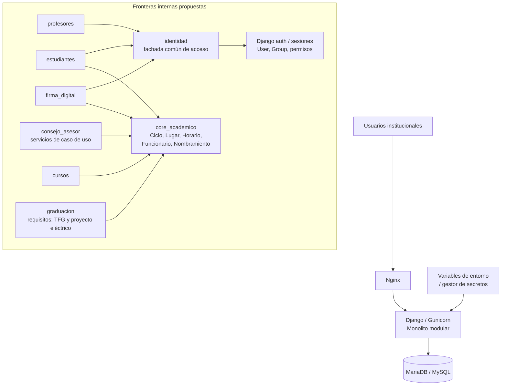

# Entrega 3 - Propuesta de mejora arquitectónica y plan de evolución

Sistema: EIEInfo  
Curso: IE-0417 - Diseño de Software  
Estudiante: Raúl Villalobos Vega  
Profesor: Rafael Esteban Badilla Alvarado

## 1. Introducción

Esta entrega toma como punto de partida la auditoría profunda de la Entrega 2. El objetivo ya no es únicamente identificar problemas de diseño, sino convertirlos en una propuesta de evolución razonable para EIEInfo.

La propuesta conserva una decisión importante: **no se recomienda transformar EIEInfo en microservicios**. Para el tamaño y contexto institucional del sistema, el monolito sigue siendo una opción viable. La mejora recomendada es evolucionar hacia un **monolito modular más explícito**, con fronteras internas claras, menor acoplamiento, configuración más segura y pruebas más enfocadas.

## 2. Objetivo de la Entrega 3

Proponer un plan de mejora que responda:

> ¿Cómo puede evolucionar EIEInfo para reducir sus riesgos principales sin romper su funcionamiento actual?

El plan se construye sobre cuatro decisiones:

1. Mantener una sola aplicación desplegable.
2. Reducir dependencias directas entre módulos.
3. Extraer reglas complejas desde vistas/forms hacia servicios internos.
4. Mejorar seguridad y operación sin introducir una reescritura completa.

## 3. Diagnóstico base que guía la propuesta

Los hallazgos priorizados de la Entrega 2 muestran una misma cadena de riesgo:

```text
Dominio concentrado
  -> importaciones cruzadas
  -> vistas y formularios con mucha lógica
  -> pruebas más costosas
  -> cambios más riesgosos
```

La evidencia principal es:

- `administrativos/models.py` concentra conceptos institucionales transversales como `Ciclo`, `Lugar`, `Horario`, `Funcionario`, `Nombramiento`, `Jefatura`, `Comision` y roles.
- `profesores/views/consejo_asesor.py` tiene 1810 líneas e importa modelos/forms/reportes de `administrativos`, `estudiantes`, `profesores`, `laboratorios`, `proyectos` y `cursos`.
- `estudiantes`, `cursos`, `trabajos_finales` y `trabajo_final_de_graduacion` importan directamente entidades de otros módulos.
- La autenticación mezcla sesiones propias con `django.contrib.auth`.
- `docker/django/secret_credentials.py` contiene valores sensibles o plausiblemente sensibles versionados.
- `settings.py` decide producción por hostname `faraday` y usa `ALLOWED_HOSTS=['*']` fuera de ese caso.

## 4. Arquitectura objetivo

Diagrama: `../diagramas/arquitectura-objetivo-eieinfo.mmd`.



La arquitectura objetivo no elimina Django ni la estructura de apps. Propone tres capas internas:

| Capa | Propósito | Ejemplos |
|---|---|---|
| Entrada | Rutas, vistas y formularios. Deben coordinar la solicitud, no cargar toda la lógica. | `urls.py`, views, forms. |
| Casos de uso | Servicios internos con reglas de negocio probables de reutilizar o probar. | asignar horario, validar colisiones, generar nombramientos, autorizar firma. |
| Dominio compartido | Conceptos transversales usados por muchos módulos. | `Ciclo`, `Lugar`, `Horario`, `Funcionario`, roles, nombramientos. |
| Identidad | Fachada común para consultar usuario actual, rol, sesión y permisos sin que cada módulo implemente su propio mecanismo. | `User`, `Group`, sesión Django, adaptador para estudiantes/profesores/administrativos. |

En este diagrama, `identidad` no representa necesariamente una app existente hoy. Representa una frontera propuesta. Su función sería ocultar las diferencias actuales entre estudiantes, profesores y administrativos. Por ejemplo, una vista no debería necesitar saber si el usuario vino de `request.session['est_id']` o de `django_login`; debería consultar una interfaz común como `identidad.obtener_usuario_actual(request)`.

## 5. Principios de mejora

### 5.1 Evolución incremental

No se recomienda una reescritura completa. La prioridad es reducir riesgo con cambios pequeños y comprobables.

### 5.2 Compatibilidad hacia atrás

Las rutas, nombres de modelos y comportamientos visibles deben mantenerse mientras se extraen servicios. Esto permite migrar por etapas.

### 5.3 Servicios antes que nuevos frameworks

La mejora principal no requiere introducir otro framework. Basta con crear módulos internos de servicios y mover reglas de negocio gradualmente.

### 5.4 Seguridad por configuración externa

Los secretos y banderas de ambiente deben venir del entorno, no del código versionado.

### 5.5 Pruebas antes de refactorizar

Antes de tocar reglas complejas, se deben crear pruebas de caracterización: pruebas que documenten el comportamiento actual para evitar regresiones.

## 6. Líneas de mejora propuestas

### M1. Extraer dominio académico compartido

Hallazgos relacionados: E2-H01, E2-H07, E2-H09.

Problema: `administrativos` contiene conceptos transversales que son usados por estudiantes, profesores, cursos, firma digital, TFG y otros módulos. Esto convierte a `administrativos` en una dependencia central.

Propuesta: crear un módulo interno gradual, por ejemplo `core_academico` o `academico`, para ubicar o encapsular conceptos compartidos.

Alcance inicial:

- `Ciclo`
- `Lugar`
- `Horario`
- constantes institucionales compartidas
- funciones de consulta de ciclo actual
- validaciones de horario reutilizables

Estrategia de migración:

1. Crear servicios o fachadas sin mover tablas al inicio.
2. Cambiar imports nuevos para usar la fachada.
3. Migrar módulos de alto impacto: `cursos`, `profesores`, `estudiantes`.
4. Evaluar después si conviene mover modelos físicamente.

Ejemplo conceptual:

```python
# Antes
from administrativos.models import Ciclo, Horario, Lugar

# Después
from core_academico.services import obtener_ciclo_actual
from core_academico.horarios import validar_colision_horaria
```

Beneficio esperado: menor dependencia directa hacia `administrativos` y mejor localización de conceptos del dominio.

Riesgo: mover modelos Django directamente puede afectar migraciones y relaciones. Por eso la primera etapa debe ser una fachada, no una mudanza de tablas.

### M2. Reducir `consejo_asesor.py` mediante servicios de caso de uso

Hallazgos relacionados: E2-H02, E2-H08, E2-H12.

Problema: `profesores/views/consejo_asesor.py` concentra 1810 líneas y coordina reglas de cursos, horarios, aulas, nombramientos, asistencias, proyectos, comisiones y reportes.

Propuesta: mantener las rutas y vistas existentes, pero extraer reglas específicas a servicios internos.

Servicios candidatos:

| Servicio propuesto | Responsabilidad |
|---|---|
| `consejo_asesor/servicios/horarios.py` | validar cupos, aulas, colisiones y cambios de horario. |
| `consejo_asesor/servicios/nombramientos.py` | crear, editar y limpiar nombramientos. |
| `consejo_asesor/servicios/asistencias.py` | asignar horas y revisar estado de asistencias. |
| `consejo_asesor/servicios/reportes.py` | preparar datos para reportes del ciclo. |

Estrategia:

1. Elegir una función pequeña de la vista.
2. Escribir prueba de comportamiento actual.
3. Extraer la lógica a un servicio.
4. Dejar la vista solo como coordinación HTTP.
5. Repetir por bloques.

Beneficio esperado: vistas más cortas, reglas más probables de probar y menor riesgo de modificar Consejo Asesor.

Riesgo: si se intenta extraer todo de una vez, aumenta el riesgo de regresiones. Debe hacerse por flujo.

### M3. Unificar identidad y sesiones

Hallazgos relacionados: E2-H03, E2-H08.

Problema: profesores y administrativos usan `django_login` con `User`, pero estudiantes manejan sesión manual con llaves como `is_logged` y `est_id`. Esto crea reglas paralelas de autenticación y permisos.

Propuesta: definir una estrategia común de identidad, sin forzar una migración inmediata de todos los datos.

Opciones:

| Opción | Ventaja | Costo |
|---|---|---|
| Mantener modelos actuales y crear adaptador común | Menor riesgo inicial | Sigue existiendo deuda interna |
| Migrar estudiantes a `django.contrib.auth.User` | Modelo de permisos más uniforme | Requiere migración cuidadosa |
| Crear perfil común de usuario institucional | Mejor consistencia de dominio | Mayor esfuerzo de diseño |

Recomendación: iniciar con un adaptador común de permisos y sesiones, luego planear migración de estudiantes a `User` si el sistema lo permite.

Ejemplo conceptual:

```python
usuario_actual = identidad.obtener_usuario_institucional(request)
if identidad.tiene_rol(usuario_actual, "profesor"):
    ...
```

Beneficio esperado: menos lógica duplicada en forms, decoradores y vistas.

### M4. Externalizar secretos y configuración por ambiente

Hallazgos relacionados: E2-H04, E2-H05.

Problema: `secret_credentials.py` contiene credenciales y `settings.py` decide ambiente por hostname. Esto dificulta migrar servidores y aumenta el riesgo de exposición.

Propuesta:

- Reemplazar secretos versionados por variables de entorno.
- Crear un archivo plantilla sin secretos reales.
- Usar `DJANGO_DEBUG`, `DJANGO_ALLOWED_HOSTS`, `DATABASE_URL` o variables equivalentes.
- Documentar configuración para desarrollo y producción.

Ejemplo conceptual:

```python
SECRET_KEY = os.environ["DJANGO_SECRET_KEY"]
DEBUG = os.environ.get("DJANGO_DEBUG", "false").lower() == "true"
ALLOWED_HOSTS = os.environ["DJANGO_ALLOWED_HOSTS"].split(",")
```

Beneficio esperado: despliegue más portable, menor exposición accidental y mejor control operacional.

Riesgo: si se cambian variables sin documentar, se puede romper el despliegue local. Por eso debe acompañarse con `.env.example`.

### M5. Documentar requisitos de graduación: TFG y proyecto eléctrico

Hallazgos relacionados: E2-H06.

Problema: `trabajos_finales` y `trabajo_final_de_graduacion` representan procesos distintos, pero ambos están relacionados con requisitos de graduación y comparten actores como estudiantes, profesores y ciclo académico. Sin una frontera explícita, futuras reglas pueden implementarse en el módulo equivocado o mezclarse innecesariamente.

Propuesta:

- Documentar qué pertenece a proyecto eléctrico.
- Documentar qué pertenece a TFG.
- Documentar qué conceptos sí comparten: estudiante, profesor, ciclo académico, documentos y estados de avance.
- Mantener claro que TFG y proyecto eléctrico no son equivalentes; son requisitos distintos dentro del proceso de graduación.
- Crear una sección de dominio "requisitos de graduación" en la documentación.

Beneficio esperado: menos ambigüedad para cambios curriculares, manteniendo separados dos procesos que son distintos aunque estén relacionados.

### M6. Mejorar observabilidad mínima

Hallazgos relacionados: E2-H13.

Problema: existen cronjobs y uso puntual de logging, pero no se observa una política uniforme de salud, logs o monitoreo. Esto significa que, si la página falla, puede ser difícil responder rápidamente preguntas básicas como:

- ¿La aplicación Django está levantada?
- ¿La base de datos responde?
- ¿Falló una tarea programada?
- ¿Cuál vista produjo el error?
- ¿El error ocurrió una vez o se repite constantemente?

Propuesta:

- Endpoint simple de salud para verificar app y base de datos.
- Logs estructurados para errores de vistas críticas.
- Registro de fallos de cronjobs.
- Documentar comandos básicos de diagnóstico.

Ejemplo de intervención:

Crear una ruta interna como:

```text
/health/
```

que responda algo como:

```json
{
  "status": "ok",
  "database": "ok",
  "app": "EIEInfo"
}
```

Si la base de datos falla, respondería:

```json
{
  "status": "error",
  "database": "unavailable",
  "app": "EIEInfo"
}
```

Esto permitiría distinguir rápidamente si el problema está en Nginx, Django o MariaDB.

Ejemplo de log útil:

```text
ERROR consejo_asesor.editar_grupo ciclo=2026-I grupo=45 usuario=profesor@ucr.ac.cr error="colision de horario"
```

Ese log es más útil que un error genérico porque indica:

- módulo afectado: Consejo Asesor;
- operación: editar grupo;
- ciclo y grupo relacionados;
- usuario que ejecutó la acción;
- causa del fallo.

Aplicado a EIEInfo, esta mejora no cambia cómo funciona el sistema para estudiantes o profesores. Solo mejora la capacidad de operación: cuando algo falla, el equipo puede diagnosticarlo con menos inspección manual.

Beneficio esperado: facilitar diagnóstico operacional sin rediseñar el sistema.

## 7. Priorización

| Prioridad | Mejora | Justificación |
|---|---|---|
| P1 | Pruebas de caracterización para Consejo Asesor | Protege el refactor más delicado y permite cambiar sin perder comportamiento actual. |
| P1 | Extraer servicios de Consejo Asesor | Reduce el archivo más acoplado y grande, que es el principal foco de riesgo de cambio. |
| P2 | Crear fachada de dominio académico | Reduce dependencia directa hacia `administrativos`. |
| P2 | Externalizar secretos y configuración | Es una mejora preventiva de seguridad y portabilidad; no se asume explotación actual ni credenciales críticas confirmadas. |
| P3 | Unificar identidad y sesiones | Mejora seguridad y mantenibilidad, pero requiere cuidado. |
| P3 | Documentar TFG y proyecto eléctrico como requisitos distintos | Reduce ambigüedad futura sin tratarlos como procesos equivalentes. |
| P4 | Observabilidad mínima | Mejora operación sin alterar reglas principales. |

## 8. Hoja de ruta

Diagrama: `../diagramas/roadmap-entrega-3.mmd`.

### Fase 0: Preparación

Objetivo: reducir riesgo antes de cambiar código.

Actividades:

- Congelar línea base de comportamiento.
- Identificar flujos críticos de Consejo Asesor.
- Agregar smoke tests mínimos sobre login, cursos, consejo asesor, firma digital y estudiantes.
- Documentar variables sensibles actuales.

Entregable esperado: lista de flujos críticos y pruebas iniciales.

### Fase 1: Bajo riesgo y alto valor

Objetivo: resolver seguridad/configuración sin tocar lógica de dominio.

Actividades:

- Crear `.env.example`.
- Reemplazar secretos por variables de entorno.
- Documentar configuración local y producción.
- Actualizar README técnico.
- Agregar healthcheck simple.

Entregable esperado: configuración reproducible y sin secretos reales en archivos versionados.

### Fase 2: Dominio compartido

Objetivo: disminuir dependencia directa hacia `administrativos`.

Actividades:

- Crear módulo `core_academico` o equivalente.
- Extraer funciones de consulta de ciclo.
- Extraer validaciones de horario y lugar.
- Mantener modelos originales al inicio para evitar migraciones riesgosas.

Entregable esperado: primeras fachadas de dominio compartido usadas por módulos nuevos o modificados.

### Fase 3: Consejo Asesor

Objetivo: reducir el archivo de 1810 líneas sin reescribir todo.

Actividades:

- Extraer lógica de horarios.
- Extraer lógica de nombramientos.
- Extraer lógica de asistencias.
- Agregar pruebas unitarias a cada servicio extraído.

Entregable esperado: `consejo_asesor.py` más corto y servicios probados.

### Fase 4: Identidad y graduación

Objetivo: atender deuda de autenticación y fronteras de dominio.

Actividades:

- Diseñar adaptador de identidad institucional.
- Planear migración de estudiantes hacia estrategia común.
- Documentar TFG y proyecto eléctrico como requisitos distintos.
- Identificar conceptos compartidos de graduación sin mezclar los procesos.

Entregable esperado: diseño de identidad común y documentación de requisitos de graduación.

## 9. Estrategia de pruebas

La propuesta requiere aumentar pruebas antes y durante los cambios.

| Tipo de prueba | Propósito | Ejemplo |
|---|---|---|
| Pruebas de caracterización | Capturar comportamiento actual antes de refactorizar. | validar asignación de horario actual. |
| Pruebas unitarias de servicios | Probar reglas extraídas sin levantar toda la vista. | validar colisión horaria. |
| Pruebas de integración | Verificar que módulos sigan conversando correctamente. | Consejo Asesor crea grupo con horario. |
| Smoke tests | Confirmar que el sistema levanta y rutas principales responden. | `/`, `/profesores/`, `/estudiantes/`, `/admin/`. |

Criterios mínimos antes de cada refactor:

- Existe una prueba del comportamiento actual.
- El cambio no altera rutas públicas.
- La vista mantiene la misma respuesta esperada.
- Se documenta cualquier cambio de configuración.

## 10. Registro de decisiones arquitectónicas propuestas

### ADR-001: Mantener monolito modular

Decisión: EIEInfo debe mantenerse como monolito Django, pero con fronteras internas más claras.

Razón: el tamaño organizacional no justifica microservicios; el problema principal es acoplamiento interno, no escalabilidad independiente.

Consecuencia: se priorizan servicios internos, módulos de dominio y mejores pruebas.

### ADR-002: No mover modelos compartidos al inicio

Decisión: la primera etapa del dominio compartido debe usar fachadas/servicios, no mover tablas ni modelos Django directamente.

Razón: mover modelos puede afectar migraciones, relaciones y datos existentes.

Consecuencia: se reduce riesgo mientras se ordenan dependencias.

### ADR-003: Externalizar configuración sensible

Decisión: secretos y configuración de ambiente deben salir del repositorio.

Razón: reduce exposición accidental y facilita despliegue en servidores distintos a `faraday`.

Consecuencia: se requiere documentación de variables y plantilla `.env.example`.

### ADR-004: Extraer servicios desde Consejo Asesor

Decisión: las reglas de horarios, nombramientos, asistencias y reportes deben moverse gradualmente fuera de la vista.

Razón: `consejo_asesor.py` es uno de los puntos de mayor acoplamiento y tamaño.

Consecuencia: la vista queda como capa HTTP y los servicios se vuelven más probables de probar.

## 11. Riesgos del plan

| Riesgo | Probabilidad | Impacto | Mitigación |
|---|---|---|---|
| Romper flujos existentes del Consejo Asesor | Media | Alto | Pruebas de caracterización y refactor por bloques. |
| Introducir migraciones innecesarias | Media | Alto | Usar fachadas antes de mover modelos. |
| Configuración local más difícil | Media | Medio | Crear `.env.example` y guía de desarrollo. |
| Duplicar servicios durante transición | Media | Medio | Marcar servicios nuevos y usos esperados. |
| Subestimar reglas históricas | Alta | Medio | Revisar pruebas existentes y consultar usuarios funcionales. |

## 12. Criterios de éxito

La propuesta se considera exitosa si:

- Nuevas reglas de horarios o nombramientos pueden probarse sin ejecutar toda la vista de Consejo Asesor.
- `administrativos` deja de ser el único punto de acceso conceptual para `Ciclo`, `Lugar` y `Horario`.
- Los secretos reales no aparecen en archivos versionados.
- La configuración de producción no depende únicamente del hostname.
- El equipo puede explicar qué pertenece a TFG, qué pertenece a proyecto eléctrico y qué conceptos comparten como requisitos de graduación.
- La documentación técnica refleja el estado real del sistema.

## 13. Conclusión

La mejora más importante para EIEInfo no es cambiar de tecnología ni dividirlo en microservicios. La mejora más importante es ordenar sus fronteras internas.

La Entrega 2 mostró que muchos hallazgos tienen una causa común: conceptos compartidos concentrados, importaciones cruzadas y reglas de negocio en vistas/forms grandes. La Entrega 3 propone responder a eso con una evolución incremental: dominio compartido, servicios internos, identidad más uniforme, configuración externa y pruebas enfocadas.

Con este plan, EIEInfo puede seguir siendo un monolito, pero un monolito más mantenible, más seguro y menos riesgoso ante cambios futuros.
