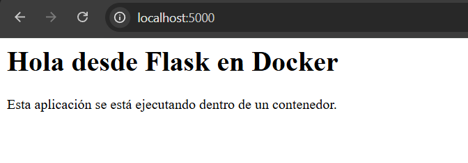

# Parte 5: Crear una aplicación sencilla

## Objetivo

Crear una aplicación web mínima con Flask para ejecutarla posteriormente dentro de un contenedor Docker.

## Archivos creados

Para esta parte se trabajó dentro de la carpeta `app/`, donde se crearon los siguientes archivos:

```text
app/
├── app.py
└── requirements.txt
```

Además, se creó un ambiente virtual de Python llamado `.venv` para probar la aplicación localmente sin modificar el entorno global del sistema.

## Contenido de `requirements.txt`

```text
flask
```

## Explicación de `requirements.txt`

El archivo `requirements.txt` define las dependencias necesarias para ejecutar la aplicación. En este caso, solamente se incluyó `flask`, ya que la aplicación web fue construida con ese framework.

## Contenido de `app.py`

```python
from flask import Flask
import os

app = Flask(__name__)

@app.route("/")
def home():
    mensaje = os.environ.get("MENSAJE", "Hola desde Flask en Docker")
    return f"""
    <h1>{mensaje}</h1>
    <p>Esta aplicación se está ejecutando dentro de un contenedor.</p>
    """

@app.route("/info")
def info():
    return {
        "app": "Laboratorio de contenedores",
        "curso": "IE0417",
        "tema": "Docker"
    }

if __name__ == "__main__":
    app.run(host="0.0.0.0", port=5000)
```

## Explicación de la aplicación

La aplicación utiliza Flask para crear un servidor web sencillo. Se definieron dos rutas principales:

- `/`: muestra un mensaje HTML. El mensaje puede configurarse mediante la variable de entorno `MENSAJE`.
- `/info`: devuelve información básica de la aplicación en formato JSON.

Se utiliza `os.environ.get()` para leer una variable de entorno. Si la variable `MENSAJE` no existe, se muestra el mensaje por defecto `Hola desde Flask en Docker`.

## Uso de `host="0.0.0.0"`

La aplicación se configuró con `host="0.0.0.0"` para que pueda escuchar conexiones desde fuera del entorno donde se ejecuta. Esto es importante cuando la aplicación corre dentro de un contenedor, porque si solo escuchara en `localhost`, podría quedar accesible únicamente desde dentro del contenedor.

## Instalación de dependencias en ambiente virtual

## Comando ejecutado

```bash
python -m pip install -r requirements.txt
```

## Resultado obtenido

```text
(.venv) raul@PC-Giorgio:~/bretes_raul/IE-0417/laboratorio-contenedores/app$ python -m pip install -r requirements.txt
Collecting flask (from -r requirements.txt (line 1))
  Downloading flask-3.1.3-py3-none-any.whl.metadata (3.2 kB)
Collecting blinker>=1.9.0 (from flask->-r requirements.txt (line 1))
  Downloading blinker-1.9.0-py3-none-any.whl.metadata (1.6 kB)
Collecting click>=8.1.3 (from flask->-r requirements.txt (line 1))
  Downloading click-8.3.3-py3-none-any.whl.metadata (2.6 kB)
Collecting itsdangerous>=2.2.0 (from flask->-r requirements.txt (line 1))
  Downloading itsdangerous-2.2.0-py3-none-any.whl.metadata (1.9 kB)
Collecting jinja2>=3.1.2 (from flask->-r requirements.txt (line 1))
  Downloading jinja2-3.1.6-py3-none-any.whl.metadata (2.9 kB)
Collecting markupsafe>=2.1.1 (from flask->-r requirements.txt (line 1))
  Downloading markupsafe-3.0.3-cp312-cp312-manylinux2014_x86_64.manylinux_2_17_x86_64.manylinux_2_28_x86_64.whl.metadata (2.7 kB)
Collecting werkzeug>=3.1.0 (from flask->-r requirements.txt (line 1))
  Downloading werkzeug-3.1.8-py3-none-any.whl.metadata (4.0 kB)
Downloading flask-3.1.3-py3-none-any.whl (103 kB)
Downloading blinker-1.9.0-py3-none-any.whl (8.5 kB)
Downloading click-8.3.3-py3-none-any.whl (110 kB)
Downloading itsdangerous-2.2.0-py3-none-any.whl (16 kB)
Downloading jinja2-3.1.6-py3-none-any.whl (134 kB)
Downloading markupsafe-3.0.3-cp312-cp312-manylinux2014_x86_64.manylinux_2_17_x86_64.manylinux_2_28_x86_64.whl (22 kB)
Downloading werkzeug-3.1.8-py3-none-any.whl (226 kB)
Installing collected packages: markupsafe, itsdangerous, click, blinker, werkzeug, jinja2, flask
Successfully installed blinker-1.9.0 click-8.3.3 flask-3.1.3 itsdangerous-2.2.0 jinja2-3.1.6 markupsafe-3.0.3 werkzeug-3.1.8
```

## Explicación

Con este comando se instalaron las dependencias indicadas en `requirements.txt` dentro del ambiente virtual `.venv`. Se instaló Flask junto con sus dependencias necesarias, como `click`, `jinja2`, `werkzeug`, `markupsafe`, `blinker` e `itsdangerous`.

El uso del ambiente virtual permitió realizar la prueba local sin instalar paquetes directamente en el Python global del sistema.

## Ejecución de la aplicación

## Comando ejecutado

```bash
python app.py
```

## Resultado obtenido

```text
(.venv) raul@PC-Giorgio:~/bretes_raul/IE-0417/laboratorio-contenedores/app$ python app.py
 * Serving Flask app 'app'
 * Debug mode: off
WARNING: This is a development server. Do not use it in a production deployment. Use a production WSGI server instead.
 * Running on all addresses (0.0.0.0)
 * Running on http://127.0.0.1:5000
 * Running on http://172.19.245.77:5000
Press CTRL+C to quit
127.0.0.1 - - [15/May/2026 01:38:08] "GET / HTTP/1.1" 200 -
127.0.0.1 - - [15/May/2026 01:38:08] "GET /favicon.ico HTTP/1.1" 404 -
^C
```

## Explicación del resultado

Después de corregir la indentación, la aplicación Flask se ejecutó correctamente. La salida indica que el servidor quedó escuchando en `0.0.0.0` y que también fue accesible desde `http://127.0.0.1:5000`.

La línea con `"GET / HTTP/1.1" 200` confirma que se accedió correctamente a la ruta principal `/` desde el navegador. El código `200` indica que la solicitud fue atendida correctamente.

La línea correspondiente a `favicon.ico` muestra un código `404`, lo cual no representa un problema para la aplicación. Esto ocurrió porque el navegador solicitó automáticamente un ícono de página, pero la aplicación no define ese archivo.

Finalmente, la ejecución se detuvo manualmente con `CTRL+C`.

## Evidencia en navegador

Después de ejecutar la aplicación con `python app.py`, se abrió la ruta principal desde Google Chrome:

```text
http://localhost:5000
```

La página cargó correctamente y mostró el mensaje definido en la aplicación Flask. Esto confirma que el servidor local estaba funcionando y que la ruta `/` respondió desde el navegador.



## Reflexión

Esta parte permitió crear y probar una aplicación web mínima con Flask antes de llevarla a Docker. También se observó que errores simples de código, como una indentación incorrecta en Python, pueden impedir que la aplicación se ejecute correctamente.

El archivo `requirements.txt` permitió declarar las dependencias necesarias de forma ordenada. Además, el uso de `host="0.0.0.0"` preparó la aplicación para ejecutarse posteriormente dentro de un contenedor. El ambiente virtual `.venv` fue creado para realizar la prueba local sin modificar el entorno global de Python del sistema.

# Parte 6: Construir una imagen con Dockerfile

## Objetivo

Construir una imagen personalizada de Docker para ejecutar la aplicación Flask creada en la parte anterior.

## Archivo `Dockerfile`

Para construir la imagen se creó el siguiente archivo dentro de la carpeta `app/`:

```dockerfile
FROM python:3.11-slim
WORKDIR /app
COPY requirements.txt .
RUN pip install --no-cache-dir -r requirements.txt
COPY . .
EXPOSE 5000
CMD ["python", "app.py"]
```

## Explicación de las instrucciones del Dockerfile

### `FROM`

La instrucción `FROM python:3.11-slim` indica la imagen base que se utilizará para construir la nueva imagen. En este caso, se usa una imagen oficial de Python en versión 3.11 y variante `slim`, que es más ligera que una imagen completa.

### `WORKDIR`

La instrucción `WORKDIR /app` define el directorio de trabajo dentro del contenedor. A partir de ese punto, los comandos siguientes se ejecutan dentro de `/app`.

### `COPY requirements.txt .`

Esta instrucción copia el archivo `requirements.txt` desde la máquina anfitriona hacia el directorio de trabajo dentro de la imagen.

### `RUN`

La instrucción `RUN pip install --no-cache-dir -r requirements.txt` instala las dependencias necesarias para la aplicación. En este caso, instala Flask dentro de la imagen.

### `COPY . .`

Esta instrucción copia el resto de los archivos de la carpeta actual hacia el directorio `/app` dentro de la imagen.

### `EXPOSE`

La instrucción `EXPOSE 5000` documenta que la aplicación dentro del contenedor utiliza el puerto 5000. Esta instrucción no publica el puerto automáticamente hacia el host, pero sirve como indicación de qué puerto usa la aplicación.

### `CMD`

La instrucción `CMD ["python", "app.py"]` define el comando que se ejecutará por defecto cuando se inicie un contenedor basado en esta imagen.

## Construcción de la imagen

## Comando ejecutado

```bash
docker build -t laboratorio-flask:1.0 .
```

## Resultado obtenido

```text
raul@PC-Giorgio:~/bretes_raul/IE-0417/laboratorio-contenedores/app$ docker build -t laboratorio-flask:1.0 .
[+] Building 27.9s (11/11) FINISHED                                               docker:default
 => [internal] load build definition from Dockerfile                                        0.2s
 => => transferring dockerfile: 195B                                                        0.0s
 => [internal] load metadata for docker.io/library/python:3.11-slim                         0.2s
 => [auth] library/python:pull token for registry-1.docker.io                               0.0s
 => [internal] load .dockerignore                                                           0.1s
 => => transferring context: 2B                                                             0.0s
 => [1/5] FROM docker.io/library/python:3.11-slim@sha256:9a7765b36773a37061455b332f18e265  12.6s
 => => resolve docker.io/library/python:3.11-slim@sha256:9a7765b36773a37061455b332f18e265e  0.1s
 => => sha256:fb4c70443787d9baef637d0b257f21b935d5feb6481f1ccdf4d07f48b2 14.37MB / 14.37MB  3.3s
 => => sha256:6f92665ed17afc6850bfbeb3fb681d6e1038fe59e2020ab126b859ec572da21b 250B / 250B  0.7s
 => => sha256:01f59aef9b5c2caa2870aa8b9b8b5806ea3c36d893cd6e2467e252fc1b1f 1.29MB / 1.29MB  1.6s
 => => sha256:57fb71246055257a374deb7564ceca10f43c2352572b501efc08add5d2 29.78MB / 29.78MB  5.1s
 => => extracting sha256:57fb71246055257a374deb7564ceca10f43c2352572b501efc08add5d24ebb61   3.6s
 => => extracting sha256:01f59aef9b5c2caa2870aa8b9b8b5806ea3c36d893cd6e2467e252fc1b1fea46   0.5s
 => => extracting sha256:fb4c70443787d9baef637d0b257f21b935d5feb6481f1ccdf4d07f48b2e393c1   2.7s
 => => extracting sha256:6f92665ed17afc6850bfbeb3fb681d6e1038fe59e2020ab126b859ec572da21b   0.1s
 => [internal] load build context                                                           1.5s
 => => transferring context: 15.47MB                                                        1.4s
 => [2/5] WORKDIR /app                                                                      0.5s
 => [3/5] COPY requirements.txt .                                                           0.1s
 => [4/5] RUN pip install --no-cache-dir -r requirements.txt                               11.1s
 => [5/5] COPY . .                                                                          0.9s
 => exporting to image                                                                      1.7s
 => => exporting layers                                                                     1.9s
 => => exporting manifest sha256:0b9b4045d20509b4799bfc0de47b151a0f95dcb103a04d497348bdbb1  0.0s
 => => exporting config sha256:f0adcf22d1e32412a90d704108186b974f748b347bbcc21fbc42d41f717  0.0s
 => => exporting attestation manifest sha256:5d0761c320d36c72bbcdcc9566ec43fa5c973c2d9162f  0.1s
 => => exporting manifest list sha256:20d449b4a098bc462e77c7f0bd812965b3ef328dbc05b6652147  0.0s
 => => naming to docker.io/library/laboratorio-flask:1.0                                    0.0s
 => => unpacking to docker.io/library/laboratorio-flask:1.0                                 2.8s
```

## Explicación del resultado

Con este comando se construyó una imagen personalizada llamada `laboratorio-flask:1.0`. El nombre `laboratorio-flask` identifica la imagen, mientras que la etiqueta `1.0` indica una versión específica.

Durante la construcción, Docker leyó el `Dockerfile`, descargó la imagen base `python:3.11-slim`, copió los archivos necesarios, instaló las dependencias desde `requirements.txt` y finalmente generó la imagen local.

## Lista de imágenes

## Comando ejecutado

```bash
docker images
```

## Resultado obtenido

```text
raul@PC-Giorgio:~/bretes_raul/IE-0417/laboratorio-contenedores/app$ docker images
                                                                             i Info →   U  In Use
IMAGE                   ID             DISK USAGE   CONTENT SIZE   EXTRA
hello-world:latest      0e760fdfbc48       25.9kB         9.49kB    U
laboratorio-flask:1.0   20d449b4a098        234MB         56.4MB
ubuntu:latest           f3d28607ddd7        160MB         45.3MB    U
```

## Explicación de `docker images`

Con el comando `docker images` se verificó que la imagen `laboratorio-flask:1.0` fue creada correctamente y quedó disponible localmente. También se observaron otras imágenes descargadas anteriormente, como `hello-world:latest` y `ubuntu:latest`.

## Ejecución del contenedor

## Comando ejecutado

```bash
docker run --name app-lab laboratorio-flask:1.0
```

## Resultado obtenido

```text
raul@PC-Giorgio:~/bretes_raul/IE-0417/laboratorio-contenedores/app$ docker run --name app-lab laboratorio-flask:1.0
 * Serving Flask app 'app'
 * Debug mode: off
WARNING: This is a development server. Do not use it in a production deployment. Use a production WSGI server instead.
 * Running on all addresses (0.0.0.0)
 * Running on http://127.0.0.1:5000
 * Running on http://172.17.0.2:5000
Press CTRL+C to quit
```

## Explicación de la ejecución

Con este comando se creó y ejecutó un contenedor llamado `app-lab` a partir de la imagen `laboratorio-flask:1.0`.

La salida muestra que la aplicación Flask inició correctamente dentro del contenedor y quedó escuchando en el puerto 5000. En esta parte todavía no se publicó el puerto hacia la máquina anfitriona con `-p`, por lo que el contenedor aparece usando el puerto interno `5000/tcp`.

## Verificación del contenedor en ejecución

## Comando ejecutado

```bash
docker ps
```

## Resultado obtenido

```text
raul@PC-Giorgio:~/bretes_raul/IE-0417/laboratorio-contenedores/app$ docker ps
CONTAINER ID   IMAGE          COMMAND           CREATED              STATUS              PORTS      NAMES
fcb73ad59b2d   20d449b4a098   "python app.py"   About a minute ago   Up About a minute   5000/tcp   app-lab
```

## Explicación de `docker ps`

Con el comando `docker ps` se verificó que el contenedor `app-lab` estaba en ejecución. La salida muestra el comando principal `"python app.py"`, el estado `Up About a minute` y el puerto interno `5000/tcp`.

## Detención y eliminación del contenedor

## Comandos ejecutados

```bash
docker stop app-lab
docker rm app-lab
```

## Resultado obtenido

```text
raul@PC-Giorgio:~/bretes_raul/IE-0417/laboratorio-contenedores/app$ docker stop app-lab
app-lab
raul@PC-Giorgio:~/bretes_raul/IE-0417/laboratorio-contenedores/app$ docker rm app-lab
app-lab
```

## Explicación

Con `docker stop app-lab` se detuvo el contenedor que estaba en ejecución. Luego, con `docker rm app-lab`, se eliminó el contenedor detenido.

Esto no elimina la imagen `laboratorio-flask:1.0`; solamente elimina la instancia del contenedor llamada `app-lab`.

## Diferencia entre imagen y contenedor en esta parte

La imagen `laboratorio-flask:1.0` es la plantilla construida a partir del `Dockerfile`. El contenedor `app-lab` fue una instancia creada a partir de esa imagen.

El nombre de la imagen se usa para indicar qué aplicación o entorno se desea ejecutar. El nombre del contenedor se usa para administrar una ejecución concreta de esa imagen.

## Reflexión

Una imagen base es el punto de partida para construir una imagen personalizada. En este caso, se usó `python:3.11-slim` porque ya incluye Python y permite construir una imagen más ligera que una versión completa.

La variante `slim` es útil porque evita incluir herramientas innecesarias. Esto reduce el tamaño de la imagen y hace que sea más práctica para distribuir o reconstruir.

En el `Dockerfile` se copiaron primero las dependencias con `COPY requirements.txt .` y luego el resto del código con `COPY . .`. Esto permite aprovechar mejor la caché de Docker, ya que las dependencias solo se reinstalan si cambia `requirements.txt`.

La diferencia entre `RUN` y `CMD` es que `RUN` se ejecuta durante la construcción de la imagen, mientras que `CMD` se ejecuta cuando se inicia un contenedor. Por eso `RUN` se usó para instalar Flask, y `CMD` se usó para iniciar la aplicación.

Si se elimina la imagen pero se conserva el `Dockerfile`, la imagen puede reconstruirse nuevamente con `docker build`. El `Dockerfile` funciona como la receta para volver a crear la imagen personalizada.