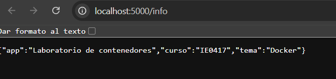
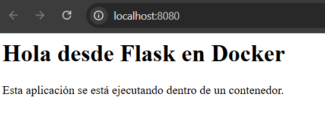
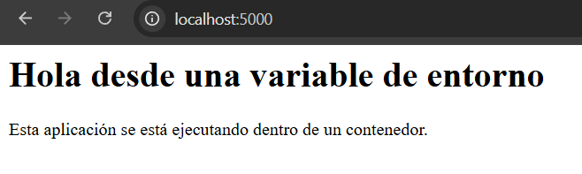
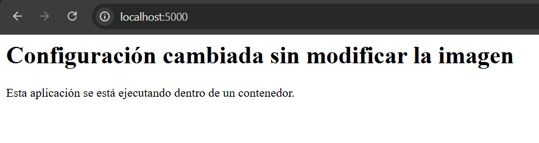

# Parte 7: Publicación de puertos

## Objetivo

Comprender cómo exponer una aplicación que se ejecuta dentro de un contenedor para poder accederla desde la máquina anfitriona mediante el navegador.

## Comandos ejecutados

```bash
docker run --name app-puertos -p 5000:5000 laboratorio-flask:1.0
docker stop app-puertos
docker rm app-puertos
docker run --name app-puertos-2 -p 8080:5000 laboratorio-flask:1.0
docker stop app-puertos-2
docker rm app-puertos-2
```

## Ejecución usando el puerto 5000 del host

## Comando ejecutado

```bash
docker run --name app-puertos -p 5000:5000 laboratorio-flask:1.0
```

## Resultado obtenido

```text
raul@PC-Giorgio:~/bretes_raul/IE-0417/laboratorio-contenedores/app$ docker run --name app-puertos -p 5000:5000 laboratorio-flask:1.0
 * Serving Flask app 'app'
 * Debug mode: off
WARNING: This is a development server. Do not use it in a production deployment. Use a production WSGI server instead.
 * Running on all addresses (0.0.0.0)
 * Running on http://127.0.0.1:5000
 * Running on http://172.17.0.2:5000
Press CTRL+C to quit
172.17.0.1 - - [15/May/2026 16:45:56] "GET /info HTTP/1.1" 200 -
172.17.0.1 - - [15/May/2026 16:45:58] "GET /info HTTP/1.1" 200 -
172.17.0.1 - - [15/May/2026 16:46:09] "GET / HTTP/1.1" 200 -
172.17.0.1 - - [15/May/2026 16:46:12] "GET /info HTTP/1.1" 200 -
^C
```

## Explicación de `-p 5000:5000`

La opción `-p 5000:5000` publica un puerto del contenedor hacia la máquina anfitriona.

El primer `5000` corresponde al puerto del host, es decir, el puerto que se usa desde la computadora local al escribir `http://localhost:5000`.

El segundo `5000` corresponde al puerto interno del contenedor, donde la aplicación Flask está escuchando.

En este caso, la aplicación dentro del contenedor escucha en el puerto `5000`, y ese mismo puerto se publicó hacia el host.

## Acceso a la ruta `/info`

Después de iniciar el contenedor, se abrió en el navegador la siguiente dirección:

```text
http://localhost:5000/info
```

La aplicación respondió correctamente. Esto se confirma en la terminal con las líneas `"GET /info HTTP/1.1" 200`, donde el código `200` indica que la solicitud fue atendida correctamente.

## Evidencia en navegador

Se tomó una captura de pantalla de la ruta `/info` accedida desde el navegador.



## Detención y eliminación del primer contenedor

## Comandos ejecutados

```bash
docker stop app-puertos
docker rm app-puertos
```

## Resultado obtenido

```text
raul@PC-Giorgio:~/bretes_raul/IE-0417/laboratorio-contenedores/app$ docker stop app-puertos
app-puertos
raul@PC-Giorgio:~/bretes_raul/IE-0417/laboratorio-contenedores/app$ docker rm app-puertos
app-puertos
```

## Explicación

Con `docker stop app-puertos` se detuvo el contenedor en ejecución. Luego, con `docker rm app-puertos`, se eliminó el contenedor detenido para liberar el nombre y evitar conflictos en ejecuciones posteriores.

## Ejecución usando el puerto 8080 del host

## Comando ejecutado

```bash
docker run --name app-puertos-2 -p 8080:5000 laboratorio-flask:1.0
```

## Resultado obtenido

```text
raul@PC-Giorgio:~/bretes_raul/IE-0417/laboratorio-contenedores/app$ docker run --name app-puertos-2 -p 8080:5000 laboratorio-flask:1.0
 * Serving Flask app 'app'
 * Debug mode: off
WARNING: This is a development server. Do not use it in a production deployment. Use a production WSGI server instead.
 * Running on all addresses (0.0.0.0)
 * Running on http://127.0.0.1:5000
 * Running on http://172.17.0.2:5000
Press CTRL+C to quit
172.17.0.1 - - [15/May/2026 16:49:08] "GET / HTTP/1.1" 200 -
172.17.0.1 - - [15/May/2026 16:49:08] "GET /favicon.ico HTTP/1.1" 404 -
^C
```

## Explicación de `-p 8080:5000`

La opción `-p 8080:5000` publica el puerto `5000` del contenedor en el puerto `8080` del host.

Esto significa que la aplicación Flask sigue escuchando internamente en el puerto `5000` dentro del contenedor, pero desde la máquina anfitriona se accede usando:

```text
http://localhost:8080
```

Este caso muestra que el puerto del host no tiene que ser igual al puerto del contenedor. Docker se encarga de redirigir el tráfico recibido en el puerto `8080` del host hacia el puerto `5000` del contenedor.

## Evidencia en navegador

Se tomó una captura de pantalla de la aplicación accedida desde el navegador mediante el puerto `8080`.



## Detención y eliminación del segundo contenedor

## Comandos ejecutados

```bash
docker stop app-puertos-2
docker rm app-puertos-2
```

## Resultado obtenido

```text
raul@PC-Giorgio:~/bretes_raul/IE-0417/laboratorio-contenedores/app$ docker stop app-puertos-2
app-puertos-2
raul@PC-Giorgio:~/bretes_raul/IE-0417/laboratorio-contenedores/app$ docker rm app-puertos-2
app-puertos-2
```

## Explicación

Con estos comandos se detuvo y eliminó el contenedor `app-puertos-2`. Esto dejó limpio el ambiente para continuar con las siguientes partes del laboratorio.

## Diferencia entre puerto del host y puerto del contenedor

El puerto del contenedor es el puerto donde la aplicación escucha dentro del entorno aislado del contenedor. En este caso, Flask escucha en el puerto `5000`.

El puerto del host es el puerto que se usa desde la máquina anfitriona para acceder al servicio. En la primera ejecución se usó el puerto `5000` del host, mientras que en la segunda ejecución se usó el puerto `8080`.

## Reflexión

No basta con que la aplicación escuche en el puerto `5000` dentro del contenedor, porque ese puerto pertenece al entorno interno del contenedor. Para acceder desde la máquina anfitriona, es necesario publicar el puerto usando la opción `-p`.

El mapeo de puertos permite conectar un puerto del host con un puerto del contenedor. Por eso, con `-p 5000:5000` se accedió mediante `http://localhost:5000`, mientras que con `-p 8080:5000` se accedió mediante `http://localhost:8080`.

La diferencia principal es que el puerto del host es el que se usa desde la computadora local, mientras que el puerto del contenedor es donde realmente escucha la aplicación dentro del contenedor.

Si dos contenedores intentan usar el mismo puerto del host al mismo tiempo, se produciría un conflicto, porque un mismo puerto del host no puede estar asignado simultáneamente a dos contenedores distintos.

# Parte 8: Logs e inspección de contenedores

## Objetivo

Aprender a observar el comportamiento de un contenedor mediante comandos de logs, inspección y monitoreo de recursos.

## Comandos ejecutados

```bash
docker run -d --name app-logs -p 5000:5000 laboratorio-flask:1.0
docker logs -f app-logs
docker inspect app-logs
docker stats
docker stop app-logs
docker rm app-logs
```

## Ejecución del contenedor en segundo plano

## Comando ejecutado

```bash
docker run -d --name app-logs -p 5000:5000 laboratorio-flask:1.0
```

## Resultado obtenido

```text
raul@PC-Giorgio:~/bretes_raul/IE-0417/laboratorio-contenedores$ docker run -d --name app-logs -p 5000:5000 laboratorio-flask:1.0
ba3d1d0273d21e6f659fb818355d5e93d985e7571e00c321ecee07c88f790e31
```

## Explicación

Con la opción `-d`, el contenedor se ejecutó en segundo plano. Esto permitió que la terminal quedara disponible para ejecutar otros comandos mientras la aplicación Flask seguía funcionando dentro del contenedor.

El contenedor se llamó `app-logs` y publicó el puerto `5000` del contenedor en el puerto `5000` del host.

## Revisión de logs en tiempo real

## Comando ejecutado

```bash
docker logs -f app-logs
```

## Resultado obtenido

```text
raul@PC-Giorgio:~/bretes_raul/IE-0417/laboratorio-contenedores$ docker logs -f app-logs
 * Serving Flask app 'app'
 * Debug mode: off
WARNING: This is a development server. Do not use it in a production deployment. Use a production WSGI server instead.
 * Running on all addresses (0.0.0.0)
 * Running on http://127.0.0.1:5000
 * Running on http://172.17.0.2:5000
Press CTRL+C to quit
172.17.0.1 - - [15/May/2026 16:56:46] "GET / HTTP/1.1" 200 -
172.17.0.1 - - [15/May/2026 17:15:20] "GET /info HTTP/1.1" 200 -
```

## Explicación de `docker logs -f`

El comando `docker logs -f app-logs` permitió observar los logs del contenedor en tiempo real.

En la salida se observó que Flask inició correctamente y que la aplicación quedó disponible en el puerto `5000`. Además, se registraron solicitudes HTTP hacia las rutas `/` e `/info`, ambas con código `200`, lo que indica que fueron atendidas correctamente.

La opción `-f` mantiene la terminal siguiendo los nuevos logs conforme ocurren. Esto resulta útil para observar el comportamiento de la aplicación mientras se accede a ella desde el navegador.

## Inspección del contenedor

## Comando ejecutado

```bash
docker inspect app-logs
```

## Resultado parcial obtenido

```text
[
    {
        "Id": "ba3d1d0273d21e6f659fb818355d5e93d985e7571e00c321ecee07c88f790e31",
        "Created": "2026-05-15T16:56:24.931158159Z",
        "Path": "python",
        "Args": [
            "app.py"
        ],
        "State": {
            "Status": "running",
            "Running": true,
            "Paused": false,
            "Restarting": false,
            "ExitCode": 0
        },
        "Name": "/app-logs",
        "HostConfig": {
            "NetworkMode": "bridge",
            "PortBindings": {
                "5000/tcp": [
                    {
                        "HostIp": "",
                        "HostPort": "5000"
                    }
                ]
            }
        },
        "Config": {
            "Cmd": [
                "python",
                "app.py"
            ],
            "Image": "laboratorio-flask:1.0",
            "WorkingDir": "/app"
        },
        "NetworkSettings": {
            "Ports": {
                "5000/tcp": [
                    {
                        "HostIp": "0.0.0.0",
                        "HostPort": "5000"
                    },
                    {
                        "HostIp": "::",
                        "HostPort": "5000"
                    }
                ]
            }
        }
    }
]
```

## Explicación de `docker inspect`

El comando `docker inspect app-logs` mostró información detallada del contenedor en formato estructurado.

Entre la información observada se incluye el identificador del contenedor, el estado de ejecución, el comando usado para iniciar la aplicación, la imagen utilizada, el directorio de trabajo, la red configurada y el mapeo de puertos.

En este caso, se verificó que el contenedor estaba en estado `running`, que fue creado a partir de la imagen `laboratorio-flask:1.0` y que el puerto `5000/tcp` del contenedor estaba publicado hacia el puerto `5000` del host.

## Revisión del uso de recursos

## Comando ejecutado

```bash
docker stats
```

## Resultado obtenido

```text
CONTAINER ID   NAME       CPU %     MEM USAGE / LIMIT     MEM %     NET I/O           BLOCK I/O        PIDS
ba3d1d0273d2   app-logs   0.02%     21.62MiB / 3.467GiB   0.61%     5.53kB / 3.28kB   23.1MB / 147kB   2
```

## Explicación de `docker stats`

El comando `docker stats` mostró el uso de recursos del contenedor en ejecución.

En la salida se observó el porcentaje de CPU, el uso de memoria, el tráfico de red, la actividad de entrada y salida en disco, y la cantidad de procesos activos. En este caso, el contenedor `app-logs` tenía un consumo bajo de CPU y memoria, lo cual es esperable para una aplicación Flask sencilla.

## Detención y eliminación del contenedor

## Comandos ejecutados

```bash
docker stop app-logs
docker rm app-logs
```

## Resultado obtenido

```text
raul@PC-Giorgio:~/bretes_raul/IE-0417$ docker stop app-logs
app-logs
raul@PC-Giorgio:~/bretes_raul/IE-0417$ docker rm app-logs
app-logs
```

## Explicación

Con `docker stop app-logs` se detuvo el contenedor que estaba en ejecución. Luego, con `docker rm app-logs`, se eliminó el contenedor detenido para limpiar el ambiente.

La imagen `laboratorio-flask:1.0` no se eliminó, solamente se eliminó la instancia del contenedor llamada `app-logs`.

## Reflexión

Los logs son importantes porque permiten observar qué está ocurriendo dentro de un contenedor sin tener que ingresar directamente a él. En este caso, los logs permitieron verificar que Flask inició correctamente y que las rutas `/` e `/info` respondieron con código `200`.

Ver logs históricos permite revisar eventos que ya ocurrieron, mientras que seguir logs en tiempo real con `docker logs -f` permite observar nuevas solicitudes o errores conforme suceden.

El comando `docker inspect` es útil porque muestra información detallada del contenedor, como su estado, imagen utilizada, comando de ejecución, configuración de red y puertos publicados.

También es importante observar el consumo de recursos con `docker stats`, ya que esto permite detectar si un contenedor está usando demasiada CPU, memoria, red o procesos. Esta información puede ser relevante para depurar problemas o evaluar el comportamiento de una aplicación en ejecución.

# Parte 9: Variables de entorno

## Objetivo

Configurar el comportamiento de un contenedor usando variables de entorno, sin modificar el código fuente ni reconstruir la imagen.

## Comandos ejecutados

```bash
docker run --name app-env -p 5000:5000 -e MENSAJE="Hola desde una variable de entorno" laboratorio-flask:1.0
docker stop app-env
docker rm app-env

docker run --name app-env-2 -p 5000:5000 -e MENSAJE="Configuración cambiada sin modificar la imagen" laboratorio-flask:1.0
docker stop app-env-2
docker rm app-env-2
```

## Primera ejecución con variable de entorno

## Comando ejecutado

```bash
docker run --name app-env -p 5000:5000 -e MENSAJE="Hola desde una variable de entorno" laboratorio-flask:1.0
```

## Resultado obtenido

```text
raul@PC-Giorgio:~/bretes_raul/IE-0417/laboratorio-contenedores$ docker run --name app-env -p 5000:5000 -e MENSAJE="Hola desde una variable de entorno" laboratorio-flask:1.0
 * Serving Flask app 'app'
 * Debug mode: off
WARNING: This is a development server. Do not use it in a production deployment. Use a production WSGI server instead.
 * Running on all addresses (0.0.0.0)
 * Running on http://127.0.0.1:5000
 * Running on http://172.17.0.2:5000
Press CTRL+C to quit
172.17.0.1 - - [15/May/2026 17:23:19] "GET / HTTP/1.1" 200 -
```

## Explicación de `-e`

La opción `-e` permite definir una variable de entorno dentro del contenedor al momento de ejecutarlo.

En este caso, se definió la variable `MENSAJE` con el valor:

```text
Hola desde una variable de entorno
```

La aplicación Flask lee esa variable mediante `os.environ.get("MENSAJE", "Hola desde Flask en Docker")`. Por eso, al acceder a la página principal, el mensaje mostrado cambió sin modificar el archivo `app.py`.

## Evidencia en navegador

Se abrió la aplicación desde el navegador en:

```text
http://localhost:5000
```

La página mostró el mensaje configurado mediante la variable de entorno.



## Segunda ejecución con otro valor de variable de entorno

## Comando ejecutado

```bash
docker run --name app-env-2 -p 5000:5000 -e MENSAJE="Configuración cambiada sin modificar la imagen" laboratorio-flask:1.0
```

## Resultado obtenido

```text
raul@PC-Giorgio:~/bretes_raul/IE-0417/laboratorio-contenedores$ docker run --name app-env-2 -p 5000:5000 -e MENSAJE="Configuración cambiada sin modificar la imagen" laboratorio-flask:1.0
 * Serving Flask app 'app'
 * Debug mode: off
WARNING: This is a development server. Do not use it in a production deployment. Use a production WSGI server instead.
 * Running on all addresses (0.0.0.0)
 * Running on http://127.0.0.1:5000
 * Running on http://172.17.0.2:5000
Press CTRL+C to quit
172.17.0.1 - - [15/May/2026 17:27:44] "GET / HTTP/1.1" 200 -
```

## Explicación del cambio

En la segunda ejecución se usó la misma imagen `laboratorio-flask:1.0`, pero se cambió el valor de la variable `MENSAJE`.

El nuevo valor fue:

```text
Configuración cambiada sin modificar la imagen
```

Esto permitió cambiar el comportamiento visible de la aplicación sin editar el código fuente y sin reconstruir la imagen Docker.

## Evidencia en navegador

Se abrió nuevamente la aplicación desde:

```text
http://localhost:5000
```

La página mostró el nuevo mensaje configurado mediante la variable de entorno.



## Detención y eliminación de contenedores

## Comandos ejecutados

```bash
docker stop app-env
docker rm app-env

docker stop app-env-2
docker rm app-env-2
```

## Explicación

Después de cada prueba, se detuvo y eliminó el contenedor correspondiente. Esto permitió liberar el nombre del contenedor y también liberar el puerto `5000` del host para la siguiente ejecución.

## Reflexión

Las variables de entorno son útiles porque permiten modificar la configuración de una aplicación sin cambiar su código fuente. En este caso, la misma imagen Docker mostró mensajes distintos dependiendo del valor asignado a `MENSAJE`.

Este mecanismo puede usarse para configurar valores como mensajes, modos de ejecución, direcciones de servicios, nombres de bases de datos, puertos internos o credenciales. Sin embargo, no es buena práctica guardar contraseñas directamente en el código, porque quedarían expuestas en el repositorio o dentro de la imagen.

La principal ventaja observada es que una misma imagen puede reutilizarse con diferentes configuraciones. Esto hace que la imagen sea más flexible y evita tener que reconstruirla cada vez que se cambia un parámetro de ejecución.