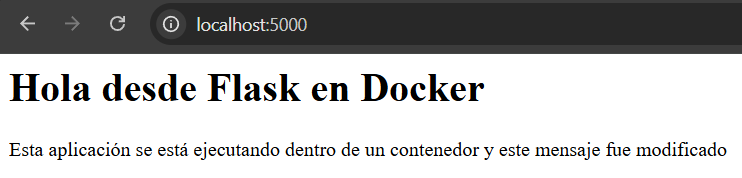

# Parte 10: Persistencia con volúmenes

## Objetivo

Comprender cómo los volúmenes permiten conservar información fuera del ciclo de vida de un contenedor.

## Comandos ejecutados

```bash
docker volume create datos-lab
docker volume ls
docker run -it --name contenedor-volumen -v datos-lab:/datos ubuntu bash
```

Dentro del primer contenedor se ejecutó:

```bash
echo "Este archivo está en un volumen" > /datos/archivo.txt
cat /datos/archivo.txt
exit
```

Luego se eliminó el primer contenedor:

```bash
docker rm contenedor-volumen
```

Después se creó un segundo contenedor usando el mismo volumen:

```bash
docker run -it --name contenedor-volumen-2 -v datos-lab:/datos ubuntu bash
```

Dentro del segundo contenedor se ejecutó:

```bash
cat /datos/archivo.txt
exit
```

Finalmente, se ejecutó:

```bash
docker rm contenedor-volumen-2
docker volume inspect datos-lab
```

## Creación del volumen

## Comando ejecutado

```bash
docker volume create datos-lab
```

## Resultado obtenido

```text
raul@PC-Giorgio:~/bretes_raul/IE-0417/laboratorio-contenedores$ docker volume create datos-lab
datos-lab
```

## Explicación

Con este comando se creó un volumen llamado `datos-lab`. Un volumen es un espacio de almacenamiento administrado por Docker que puede montarse dentro de uno o varios contenedores.

A diferencia de los archivos creados únicamente dentro del sistema de archivos de un contenedor, los datos guardados en un volumen pueden mantenerse aunque el contenedor sea eliminado.

## Lista de volúmenes

## Comando ejecutado

```bash
docker volume ls
```

## Resultado obtenido

```text
raul@PC-Giorgio:~/bretes_raul/IE-0417/laboratorio-contenedores$ docker volume ls
DRIVER    VOLUME NAME
local     datos-lab
```

## Explicación

Con el comando `docker volume ls` se verificó que el volumen `datos-lab` fue creado correctamente. El driver `local` indica que Docker administra el volumen de forma local en el entorno donde se está ejecutando.

## Primer contenedor con volumen montado

## Comando ejecutado

```bash
docker run -it --name contenedor-volumen -v datos-lab:/datos ubuntu bash
```

## Resultado obtenido

```text
raul@PC-Giorgio:~/bretes_raul/IE-0417/laboratorio-contenedores$ docker run -it --name contenedor-volumen -v datos-lab:/datos ubuntu bash
root@d5524b37ae29:/# echo "Este archivo está en un volumen" > /datos/archivo.txt
root@d5524b37ae29:/# cat /datos/archivo.txt
Este archivo está en un volumen
root@d5524b37ae29:/# exit
exit
```

## Explicación del montaje

Con la opción `-v datos-lab:/datos` se montó el volumen `datos-lab` dentro del contenedor en la ruta `/datos`.

Esto significa que cualquier archivo creado dentro de `/datos` realmente queda almacenado en el volumen administrado por Docker, no solamente en el sistema de archivos interno del contenedor.

Dentro del contenedor se creó el archivo `/datos/archivo.txt` y luego se verificó su contenido con `cat`.

## Eliminación del primer contenedor

## Comando ejecutado

```bash
docker rm contenedor-volumen
```

## Resultado obtenido

```text
raul@PC-Giorgio:~/bretes_raul/IE-0417/laboratorio-contenedores$ docker rm contenedor-volumen
contenedor-volumen
```

## Explicación

Con este comando se eliminó el primer contenedor. Sin embargo, no se eliminó el volumen `datos-lab`, ya que los volúmenes tienen un ciclo de vida independiente al de los contenedores.

## Segundo contenedor usando el mismo volumen

## Comando ejecutado

```bash
docker run -it --name contenedor-volumen-2 -v datos-lab:/datos ubuntu bash
```

## Resultado obtenido

```text
raul@PC-Giorgio:~/bretes_raul/IE-0417/laboratorio-contenedores$ docker run -it --name contenedor-volumen-2 -v datos-lab:/datos ubuntu bash
root@760c5f719c39:/# cat /datos/archivo.txt
Este archivo está en un volumen
root@760c5f719c39:/# exit
exit
```

## Explicación

Se creó un segundo contenedor llamado `contenedor-volumen-2` y se montó nuevamente el volumen `datos-lab` en la ruta `/datos`.

Al ejecutar `cat /datos/archivo.txt`, el archivo creado desde el primer contenedor seguía disponible. Esto demuestra que el dato no pertenecía únicamente al primer contenedor, sino al volumen.

## Eliminación del segundo contenedor

## Comando ejecutado

```bash
docker rm contenedor-volumen-2
```

## Resultado obtenido

```text
raul@PC-Giorgio:~/bretes_raul/IE-0417/laboratorio-contenedores$ docker rm contenedor-volumen-2
contenedor-volumen-2
```

## Explicación

Con este comando se eliminó el segundo contenedor. El volumen `datos-lab` continuó existiendo porque no fue eliminado explícitamente.

## Inspección del volumen

## Comando ejecutado

```bash
docker volume inspect datos-lab
```

## Resultado obtenido

```text
raul@PC-Giorgio:~/bretes_raul/IE-0417/laboratorio-contenedores$ docker volume inspect datos-lab
[
    {
        "CreatedAt": "2026-05-15T17:35:54Z",
        "Driver": "local",
        "Labels": null,
        "Mountpoint": "/var/lib/docker/volumes/datos-lab/_data",
        "Name": "datos-lab",
        "Options": null,
        "Scope": "local"
    }
]
```

## Explicación de `docker volume inspect`

Con el comando `docker volume inspect datos-lab` se obtuvo información detallada del volumen.

Entre los datos más importantes se observa el nombre del volumen, el driver utilizado, la fecha de creación, el alcance local y el punto de montaje interno donde Docker almacena los datos del volumen.

## Reflexión

Los volúmenes resuelven el problema de la pérdida de datos cuando un contenedor se elimina. En esta parte, el archivo `archivo.txt` siguió existiendo aunque el primer contenedor fue eliminado.

El volumen no pertenece a un contenedor específico. Puede ser montado por distintos contenedores, como ocurrió con `contenedor-volumen` y `contenedor-volumen-2`.

Eliminar un contenedor no elimina automáticamente sus volúmenes. En cambio, eliminar un volumen sí borra los datos almacenados en él, por lo que debe hacerse con cuidado.

En casos reales, los volúmenes se usarían para conservar información de bases de datos, archivos cargados por usuarios, configuraciones persistentes o cualquier dato que deba mantenerse aunque los contenedores se eliminen y vuelvan a crearse.

# Parte 11: Bind mounts

## Objetivo

Comprender la diferencia entre un volumen administrado por Docker y el montaje directo de una carpeta local dentro de un contenedor.

## Comandos ejecutados

```bash
docker run --name app-bind -p 5000:5000 -v "$(pwd)":/app laboratorio-flask:1.0
docker stop app-bind
docker rm app-bind

docker run --name app-bind-2 -p 5000:5000 -v "$(pwd)":/app laboratorio-flask:1.0
docker stop app-bind-2
docker rm app-bind-2
```

## Primera ejecución con bind mount

## Comando ejecutado

```bash
docker run --name app-bind -p 5000:5000 -v "$(pwd)":/app laboratorio-flask:1.0
```

## Resultado obtenido

```text
raul@PC-Giorgio:~/bretes_raul/IE-0417/laboratorio-contenedores/app$ docker run --name app-bind -p 5000:5000 -v "$(pwd)":/app laboratorio-flask:1.0
 * Serving Flask app 'app'
 * Debug mode: off
WARNING: This is a development server. Do not use it in a production deployment. Use a production WSGI server instead.
 * Running on all addresses (0.0.0.0)
 * Running on http://127.0.0.1:5000
 * Running on http://172.17.0.2:5000
Press CTRL+C to quit
172.17.0.1 - - [15/May/2026 17:40:21] "GET / HTTP/1.1" 200 -
172.17.0.1 - - [15/May/2026 17:51:14] "GET / HTTP/1.1" 200 -
^C
```

## Explicación del bind mount

Con la opción `-v "$(pwd)":/app` se montó la carpeta local actual dentro del contenedor en la ruta `/app`.

En este caso, `$(pwd)` representa la carpeta `app/` del proyecto en la máquina anfitriona. Al montarla sobre `/app` dentro del contenedor, el contenedor utiliza directamente los archivos locales del proyecto, en lugar de depender únicamente de los archivos copiados durante la construcción de la imagen.

Esto permite modificar archivos en el host y que esos cambios estén disponibles dentro del contenedor.

## Modificación del archivo `app.py`

Se modificó el mensaje HTML de la ruta principal en el archivo `app.py`:

```python
<p>Esta aplicación se está ejecutando dentro de un contenedor y este mensaje fue modificado </p>
```

Luego se volvió a ejecutar la aplicación usando otro contenedor con el mismo bind mount.

## Segunda ejecución después de modificar el código

## Comando ejecutado

```bash
docker run --name app-bind-2 -p 5000:5000 -v "$(pwd)":/app laboratorio-flask:1.0
```

## Resultado obtenido

```text
raul@PC-Giorgio:~/bretes_raul/IE-0417/laboratorio-contenedores/app$ docker run --name app-bind-2 -p 5000:5000 -v "$(pwd)":/app laboratorio-flask:1.0
 * Serving Flask app 'app'
 * Debug mode: off
WARNING: This is a development server. Do not use it in a production deployment. Use a production WSGI server instead.
 * Running on all addresses (0.0.0.0)
 * Running on http://127.0.0.1:5000
 * Running on http://172.17.0.2:5000
Press CTRL+C to quit
172.17.0.1 - - [15/May/2026 17:58:49] "GET / HTTP/1.1" 200 -
^C
```

## Evidencia en navegador

Después de modificar el archivo `app.py`, se abrió nuevamente la aplicación desde el navegador:

```text
http://localhost:5000
```

La página mostró el mensaje modificado, lo cual confirma que el contenedor estaba usando los archivos locales montados mediante el bind mount.



## Detención y eliminación de contenedores

## Comandos ejecutados

```bash
docker stop app-bind
docker rm app-bind

docker stop app-bind-2
docker rm app-bind-2
```

## Resultado obtenido

```text
raul@PC-Giorgio:~/bretes_raul/IE-0417/laboratorio-contenedores/app$ docker stop app-bind
app-bind
raul@PC-Giorgio:~/bretes_raul/IE-0417/laboratorio-contenedores/app$ docker rm app-bind
app-bind

raul@PC-Giorgio:~/bretes_raul/IE-0417/laboratorio-contenedores/app$ docker stop app-bind-2
app-bind-2
raul@PC-Giorgio:~/bretes_raul/IE-0417/laboratorio-contenedores/app$ docker rm app-bind-2
app-bind-2
```

## Diferencia entre volumen y bind mount

Un volumen como `datos-lab:/datos` es administrado por Docker. Docker decide dónde se almacena físicamente en el sistema y permite conservar datos de forma persistente aunque los contenedores se eliminen.

Un bind mount como `"$(pwd)":/app` monta directamente una carpeta del host dentro del contenedor. En este caso, los archivos de la carpeta local `app/` se usaron directamente dentro del contenedor.

## Reflexión

Un bind mount es conveniente durante el desarrollo porque permite modificar archivos en la máquina anfitriona y probar esos cambios dentro del contenedor sin reconstruir la imagen.

Para datos persistentes de una aplicación, un volumen suele ser más adecuado porque Docker lo administra directamente y lo separa del código fuente local. En cambio, para desarrollo, un bind mount resulta más práctico porque conecta el código local con el entorno del contenedor.

También se debe tener cuidado al montar carpetas del host dentro del contenedor, porque el contenedor puede leer o modificar archivos locales. Por eso, conviene montar únicamente las carpetas necesarias y evitar exponer directorios sensibles del sistema.