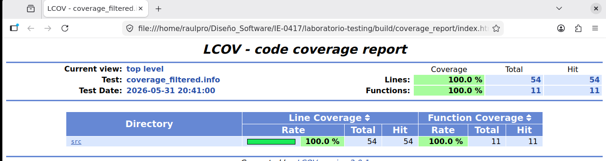

# Parte 8: cobertura de código

## Objetivo de la parte

En esta parte se trabajó con la medición de cobertura de código.

El objetivo fue configurar el proyecto para compilar con soporte de cobertura, ejecutar las pruebas unitarias y generar un reporte que permitiera identificar qué partes del código fuente fueron ejecutadas durante las pruebas.

---

## ¿Qué es cobertura de código?

La cobertura de código es una métrica que indica qué líneas o funciones del programa fueron ejecutadas durante la ejecución de las pruebas.

Esta información permite identificar partes del código que sí están siendo evaluadas y otras que todavía no han sido cubiertas por las pruebas.

La cobertura es útil para mejorar el conjunto de pruebas, aunque una cobertura alta no garantiza por sí sola que el programa esté libre de errores.

---

## Limpieza de compilaciones anteriores

Primero se eliminó la carpeta `build` anterior y se creó nuevamente para evitar que quedaran archivos de compilaciones previas:

```bash id="hrd9m3"
cd ..
rm -rf build
mkdir build
cd build
```

Luego se verificó la estructura del proyecto con:

```bash id="f4bdke"
ls
```

La salida mostró que el proyecto seguía teniendo sus carpetas principales:

```text id="dhnm9h"
build  CMakeLists.txt  docs  include  src  tests
```

---

## Configuración con cobertura

Desde la carpeta `build`, se ejecutó el siguiente comando:

```bash id="r4m4zf"
cmake -DENABLE_COVERAGE=ON ..
```

La configuración se realizó correctamente y CMake indicó explícitamente que la cobertura fue habilitada:

```text id="b67f2l"
-- Coverage enabled
```

También apareció una advertencia de CMake relacionada con `FetchContent` y la política `CMP0135`, pero esta advertencia no impidió continuar con la configuración.

La salida final indicó que los archivos de compilación fueron generados correctamente.

---

## Compilación del proyecto

Después de configurar la cobertura, se compiló el proyecto con:

```bash id="7jyn3v"
make
```

La compilación finalizó correctamente y se construyeron los objetivos del proyecto, incluyendo `project_lib`, `gtest`, `gtest_main`, `run_tests`, `gmock` y `gmock_main`.

Esto confirmó que el ejecutable de pruebas quedó listo para ser ejecutado con soporte de cobertura.

---

## Ejecución de pruebas

Luego se ejecutaron las pruebas unitarias con:

```bash id="g06z6q"
./run_tests
```

Google Test ejecutó 41 pruebas distribuidas en 3 conjuntos de pruebas:

```text id="u0t7ia"
[==========] Running 41 tests from 3 test suites.
```

Los conjuntos ejecutados fueron:

* `CalculatorTest`
* `StringUtilsTest`
* `GradeUtilsTest`

El resultado final fue exitoso:

```text id="72qjgm"
[==========] 41 tests from 3 test suites ran. (11 ms total)
[  PASSED  ] 41 tests.
```

Esto confirmó que todas las pruebas pasaron correctamente antes de generar el reporte de cobertura.

---

## Problema encontrado en el primer intento

En el primer intento de generar el reporte de cobertura se usaron los comandos básicos de `lcov`, pero apareció un error relacionado con coincidencias incorrectas de líneas en archivos de prueba.

El error principal fue:

```text id="gghyia"
geninfo: ERROR: mismatched end line for ...
```

Debido a ese error, no se pudo generar correctamente el archivo `coverage.info`, lo que provocó que tampoco se pudieran generar `coverage_filtered.info` ni el reporte HTML.

Además, en uno de los intentos se escribió por error el comando `enhtml`, cuando el comando correcto es `genhtml`.

---

## Cambios realizados para corregir la generación del reporte

Para lograr obtener correctamente el reporte de cobertura, se hicieron los siguientes cambios:

1. Se agregó la opción `--ignore-errors mismatch,gcov` al comando de captura de `lcov`.
2. Se agregó la opción `--ignore-errors empty,unused` al comando de filtrado.
3. Se utilizó el comando correcto `genhtml` para generar el reporte HTML.
4. Se listó el contenido de `coverage_filtered.info` con `lcov --list` para verificar que el archivo sí se hubiera generado.

Los comandos utilizados finalmente fueron:

```bash id="t4qap7"
lcov --capture --directory . --output-file coverage.info --ignore-errors mismatch,gcov
lcov --remove coverage.info '/usr/*' '*/_deps/*' '*/tests/*' --output-file coverage_filtered.info --ignore-errors empty,unused
lcov --list coverage_filtered.info
genhtml coverage_filtered.info --output-directory coverage_report --ignore-errors source
```

Estos cambios permitieron completar correctamente la generación de la cobertura.

---

## Captura de la información de cobertura

Al ejecutar el comando de captura, `lcov` encontró archivos `.gcda` generados por la ejecución de las pruebas y procesó archivos asociados al código fuente del proyecto:

```text id="vu5tqv"
Processing ./CMakeFiles/project_lib.dir/src/grade_utils.cpp.gcda
Processing ./CMakeFiles/project_lib.dir/src/calculator.cpp.gcda
Processing ./CMakeFiles/project_lib.dir/src/string_utils.cpp.gcda
```

También aparecieron varias advertencias de tipo `mismatch`, pero al usar la opción `--ignore-errors mismatch,gcov`, la herramienta pudo continuar y completar la creación del archivo `.info`.

La salida indicó:

```text id="pw8g2h"
Finished .info-file creation
```

---

## Filtrado del reporte

Luego se filtró el archivo `coverage.info` para eliminar información irrelevante del sistema, dependencias externas y archivos de prueba.

La salida mostró que se excluyeron correctamente múltiples archivos de `/usr/`, `_deps` y `tests/`, y luego se escribió el archivo:

```text id="ecq45v"
Writing data to coverage_filtered.info
```

Esto confirmó que ya se había generado correctamente el archivo filtrado con la cobertura relevante del código fuente del proyecto.

---

## Resultado de `lcov --list`

Después de generar el archivo filtrado, se ejecutó:

```bash id="ccvcyj"
lcov --list coverage_filtered.info
```

La salida mostró el resumen general de cobertura:

```text id="up9vb5"
Summary coverage rate:
  lines......: 100.0% (54 of 54 lines)
  functions..: 100.0% (11 of 11 functions)
  branches...: no data found
```

También se indicó que no había datos de cobertura de ramas:

```text id="j1kz4f"
branches...: no data found
```

Esto significa que se obtuvo cobertura completa de líneas y funciones, pero no se generó información de ramas en esta ejecución.

---

## Generación del reporte HTML

Finalmente, se generó el reporte HTML con:

```bash id="j6j37j"
genhtml coverage_filtered.info --output-directory coverage_report --ignore-errors source
```

La salida mostró que `genhtml` procesó correctamente los tres archivos fuente:

```text id="andk8w"
Processing file src/grade_utils.cpp
  lines=21 hit=21 functions=3 hit=3
Processing file src/calculator.cpp
  lines=12 hit=12 functions=5 hit=5
Processing file src/string_utils.cpp
  lines=21 hit=21 functions=3 hit=3
```

El resultado final del reporte HTML fue:

```text id="cdwxf8"
Overall coverage rate:
  lines......: 100.0% (54 of 54 lines)
  functions......: 100.0% (11 of 11 functions)
```

Esto confirma que el código fuente del proyecto alcanzó cobertura completa de líneas y funciones.

---

## Evidencia visual del reporte

Se tomó una captura de pantalla del archivo HTML generado, en la cual se observa el resultado del reporte con:

* `100% line coverage`
* `100% function coverage`



---

## Porcentaje de cobertura obtenido

El porcentaje final de cobertura obtenido fue:

* **Cobertura de líneas:** 100.0% (54 de 54 líneas)
* **Cobertura de funciones:** 100.0% (11 de 11 funciones)

No se reportó cobertura de ramas, ya que la herramienta indicó:

* **Cobertura de ramas:** no data found

---

## Archivos con mayor cobertura

Los tres archivos fuente del proyecto quedaron completamente cubiertos en líneas y funciones:

```text id="fifha9"
src/calculator.cpp
src/grade_utils.cpp
src/string_utils.cpp
```

El reporte HTML mostró que estos archivos fueron procesados con éxito y que sus líneas y funciones quedaron cubiertas por las pruebas.

---

## Archivos con menor cobertura

No hubo archivos fuente del proyecto con cobertura parcial en el reporte HTML final.

Los tres archivos fuente alcanzaron cobertura completa de líneas y funciones.

---

## Líneas o ramas que no fueron cubiertas

No quedaron líneas ni funciones sin cubrir en el código fuente del proyecto, ya que el reporte HTML indicó cobertura total en ambos casos.

Sin embargo, no se obtuvo información sobre ramas, por lo que no fue posible analizar cobertura de decisiones condicionales a nivel de ramas.

---

## Dos pruebas adicionales que podrían aumentar o fortalecer la cobertura

Aunque ya se obtuvo 100% de cobertura de líneas y funciones, aún se pueden agregar pruebas que fortalezcan la calidad del conjunto de pruebas.

Una primera prueba adicional podría verificar el conteo de vocales en mayúsculas:

```cpp id="p0m2hy"
TEST(StringUtilsTest, CountVowelsUppercaseText) {
    EXPECT_EQ(count_vowels("AEIOU"), 5);
}
```

Esta prueba reforzaría la verificación del manejo de mayúsculas en `count_vowels()`.

Una segunda prueba adicional podría probar el promedio con un único valor:

```cpp id="5c6t9c"
TEST(GradeUtilsTest, CalculateAverageSingleGrade) {
    std::vector<int> grades = {100};
    EXPECT_DOUBLE_EQ(average(grades), 100.0);
}
```

Esta prueba reforzaría el comportamiento de `average()` en un caso simple pero válido.

---

## Resultado obtenido

El resultado obtenido fue exitoso.

Se logró:

1. Configurar el proyecto con soporte de cobertura.
2. Compilar el proyecto correctamente.
3. Ejecutar 41 pruebas con resultado exitoso.
4. Corregir el problema inicial de `lcov`.
5. Generar el archivo `coverage_filtered.info`.
6. Generar el reporte HTML final.
7. Confirmar una cobertura de 100% en líneas y 100% en funciones.

---

## ¿Qué se aprendió?

Se aprendió que la generación de cobertura no depende únicamente de ejecutar las pruebas, sino también de usar correctamente las herramientas de reporte.

También se observó que errores de herramientas como `lcov` pueden corregirse ajustando las opciones de ejecución, especialmente cuando aparecen advertencias o errores de tipo `mismatch`.

Además, se comprendió la importancia de diferenciar entre:

* errores del código,
* errores de las pruebas,
* y errores de herramientas de análisis.

Finalmente, se confirmó que una buena batería de pruebas puede cubrir completamente el código fuente del proyecto.

---

## Preguntas de reflexión

### 1. ¿Qué significa tener 100% de cobertura?

Tener 100% de cobertura significa que todas las líneas o funciones medidas por la herramienta fueron ejecutadas al menos una vez durante las pruebas.

En este caso, significa que las 54 líneas relevantes del código fuente y las 11 funciones del proyecto fueron ejecutadas por el conjunto de pruebas.

---

### 2. ¿Tener 100% de cobertura garantiza que el programa no tiene errores?

No. Tener 100% de cobertura no garantiza que el programa esté libre de errores.

La cobertura solo indica que el código fue ejecutado, pero no asegura por sí sola que todos los comportamientos posibles hayan sido verificados con suficiente profundidad.

Un conjunto de pruebas puede ejecutar todas las líneas y aun así dejar pasar errores de lógica o casos no considerados.

---

### 3. ¿Qué diferencia hay entre cobertura de líneas y cobertura de ramas?

La cobertura de líneas indica qué líneas del código fueron ejecutadas.

La cobertura de ramas indica si se probaron distintos caminos de decisión, por ejemplo, tanto la condición verdadera como la falsa de un `if`.

En este laboratorio se obtuvo información de cobertura de líneas y funciones, pero no se reportaron datos de ramas.

---

### 4. ¿Por qué una línea ejecutada no necesariamente significa que fue bien probada?

Porque una línea puede haber sido alcanzada por una prueba sin que necesariamente se haya verificado a fondo su comportamiento.

Para considerar que una parte del código está bien probada, no basta con ejecutarla; también es necesario comprobar que produce el resultado esperado en diferentes situaciones.

---

### 5. ¿Cómo puede ayudar la cobertura a mejorar las pruebas?

La cobertura ayuda a identificar qué partes del código no han sido ejecutadas y, por lo tanto, qué zonas necesitan nuevas pruebas.

Incluso cuando la cobertura es alta, también sirve para revisar si las pruebas están cubriendo los casos relevantes con suficiente profundidad y variedad.

---
