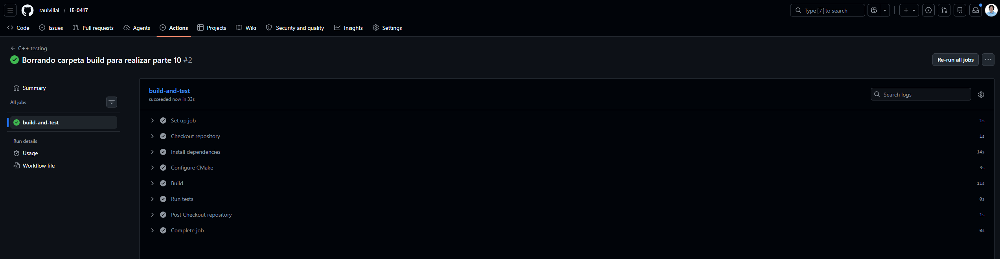

# Parte 10: integración continua con GitHub Actions

## Objetivo de la parte

En esta parte se configuró un workflow de GitHub Actions para ejecutar automáticamente las pruebas unitarias del proyecto cada vez que se suben cambios al repositorio.

El objetivo fue comprobar que el proyecto no solo compila y ejecuta pruebas correctamente de forma local, sino también en un ambiente externo proporcionado por GitHub.

---

## ¿Qué es integración continua?

La integración continua, también conocida como CI, es una práctica de desarrollo en la que los cambios realizados en el código se verifican automáticamente.

En este laboratorio, la integración continua se utilizó para compilar el proyecto y ejecutar las pruebas unitarias en GitHub Actions después de hacer `git push`.

Esto ayuda a detectar errores rápidamente antes de integrar cambios al repositorio principal.

---

## Archivo de workflow creado

Se creó el archivo:

```bash
.github/workflows/testing.yml
```

Este archivo contiene las instrucciones que GitHub Actions debe ejecutar automáticamente.

---

## Ubicación correcta del workflow

Inicialmente, el archivo `.github/workflows/testing.yml` se encontraba dentro de la carpeta `laboratorio-testing`.

La estructura inicial era similar a:

```bash
laboratorio-testing/.github/workflows/testing.yml
```

Sin embargo, GitHub Actions no detectaba el workflow porque los archivos de workflow deben estar en la raíz del repositorio.

Por eso, se movió la carpeta `.github` a la raíz del repositorio, quedando con la siguiente estructura:

```bash
IE-0417/
├── .github/
│   └── workflows/
│       └── testing.yml
└── laboratorio-testing/
    ├── CMakeLists.txt
    ├── include/
    ├── src/
    ├── tests/
    └── docs/
```

Después de mover el archivo, GitHub Actions pudo detectar el workflow correctamente.

---

## Contenido del workflow

El archivo `testing.yml` quedó configurado para ejecutar las pruebas en la rama de trabajo `laboratorio-testing-branch`.

```yaml
name: C++ testing

on:
  push:
    branches: [ "laboratorio-testing-branch" ]
  pull_request:
    branches: [ "main" ]

jobs:
  build-and-test:
    runs-on: ubuntu-latest

    steps:
      - name: Checkout repository
        uses: actions/checkout@v4

      - name: Install dependencies
        run: |
          sudo apt update
          sudo apt install -y build-essential cmake lcov

      - name: Configure CMake
        run: |
          cd laboratorio-testing
          mkdir -p build
          cd build
          cmake ..

      - name: Build
        run: |
          cd laboratorio-testing/build
          make

      - name: Run tests
        run: |
          cd laboratorio-testing/build
          ./run_tests
```

---

## ¿En qué eventos se ejecuta el workflow?

El workflow se ejecuta automáticamente cuando se hace `push` a la rama:

```bash
laboratorio-testing-branch
```

También está configurado para ejecutarse cuando se abre o actualiza un `pull_request` hacia la rama:

```bash
main
```

Esto permite verificar automáticamente los cambios antes de integrarlos a la rama principal.

---

## Pasos que ejecuta el workflow

El workflow ejecuta los siguientes pasos:

1. Descarga el contenido del repositorio usando `actions/checkout@v4`.
2. Instala las dependencias necesarias: `build-essential`, `cmake` y `lcov`.
3. Entra a la carpeta `laboratorio-testing`.
4. Elimina cualquier carpeta `build` previa.
5. Configura el proyecto con CMake.
6. Compila el proyecto.
7. Ejecuta el archivo de pruebas `run_tests`.

---

## Problema encontrado: GitHub Actions no detectaba el workflow

Al revisar inicialmente la pestaña `Actions` en GitHub, no aparecía el workflow creado.

En lugar de mostrar una ejecución, GitHub mostraba la pantalla inicial de configuración de Actions.

Esto ocurrió porque la carpeta `.github` estaba dentro de `laboratorio-testing`, pero GitHub espera que esté en la raíz del repositorio.

---

## Corrección realizada: mover `.github` a la raíz del repositorio

Para corregir el problema, se movió la carpeta `.github` a la raíz del repositorio.

La ubicación correcta fue:

```bash
.github/workflows/testing.yml
```

Después de realizar este cambio y subirlo con `git push`, GitHub Actions detectó el workflow correctamente.

---

## Problema encontrado: error con `CMakeCache.txt`

Después de que GitHub Actions detectó el workflow, apareció un error durante la configuración con CMake.

El mensaje indicaba que el archivo `CMakeCache.txt` había sido creado en una ruta local de la computadora:

```text
/home/raulpro/Diseño_Software/IE-0417/laboratorio-testing/build
```

pero GitHub Actions intentaba usarlo desde otra ruta:

```text
/home/runner/work/IE-0417/IE-0417/laboratorio-testing/build
```

Esto ocurrió porque la carpeta `build` había sido subida al repositorio, aunque esa carpeta es generada automáticamente durante la compilación y depende de la computadora donde se ejecuta CMake.

---

## Corrección realizada: eliminar `build` del repositorio

Para corregir el problema, se eliminó la carpeta `build` del seguimiento de Git.


---


## Ejecución exitosa del workflow

Después de mover `.github` a la raíz del repositorio, eliminar `build` del seguimiento de Git y ajustar el workflow, GitHub Actions ejecutó correctamente el proceso de integración continua.

El workflow se ejecutó en GitHub y completó los pasos de configuración, compilación y ejecución de pruebas.

---

## Evidencia del workflow exitoso

Se tomó una captura de pantalla de la ejecución del workflow en GitHub Actions.

En la imagen se observa que el workflow fue detectado y ejecutado correctamente.





## ¿Qué pasaría si una prueba falla en GitHub Actions?

Si una prueba falla en GitHub Actions, el workflow se marcaría como fallido.

En ese caso, GitHub mostraría el paso que produjo el error, normalmente el paso `Run tests`.

Al abrir ese paso, se podría revisar la salida de Google Test para identificar cuál prueba falló, qué resultado se esperaba y qué resultado se obtuvo.

Esto permite detectar errores antes de integrar cambios al repositorio principal.

---

## Resultado obtenido

El resultado final fue exitoso.

Se logró configurar GitHub Actions para ejecutar automáticamente las pruebas del proyecto.

Además, se resolvieron dos problemas importantes:

1. El archivo `.github/workflows/testing.yml` debía estar en la raíz del repositorio.
2. La carpeta `build` no debía subirse al repositorio porque contiene archivos generados localmente.

Después de corregir estos puntos, el workflow pudo ejecutarse correctamente.

---

## ¿Qué se aprendió?

Se aprendió que GitHub Actions requiere que los workflows estén ubicados en la carpeta `.github/workflows` en la raíz del repositorio.

También se comprendió que la carpeta `build` no debe formar parte del repositorio, porque contiene archivos generados automáticamente y rutas específicas de la computadora local.

Además, se observó que la integración continua permite verificar el proyecto en un ambiente limpio, distinto al de la computadora del desarrollador.

---

## Preguntas de reflexión

### 1. ¿Por qué es útil ejecutar pruebas automáticamente en GitHub?

Es útil porque permite verificar que el proyecto compile y que las pruebas pasen cada vez que se suben cambios al repositorio.

Esto ayuda a detectar errores rápidamente y evita depender únicamente de la ejecución local.

---

### 2. ¿Qué problema resuelve la integración continua?

La integración continua ayuda a detectar errores antes de integrar cambios al proyecto principal.

También permite confirmar que el código funciona en un ambiente limpio y reproducible, no solo en la computadora del desarrollador.

---

### 3. ¿Por qué conviene ejecutar pruebas antes de integrar cambios?

Conviene ejecutar pruebas antes de integrar cambios porque así se reduce el riesgo de subir código que rompa funcionalidades existentes.

Si una prueba falla, el equipo puede corregir el problema antes de mezclar los cambios con la rama principal.

---

### 4. ¿Qué información proporciona GitHub Actions cuando un workflow falla?

GitHub Actions muestra qué workflow falló, qué job produjo el error y en cuál paso ocurrió el problema.

Además, permite revisar los logs de ejecución, donde se puede observar si el fallo ocurrió durante la instalación de dependencias, la configuración, la compilación o la ejecución de pruebas.

---

### 5. ¿Cómo ayuda CI a mejorar la colaboración en equipo?

CI ayuda a mejorar la colaboración porque todos los integrantes pueden confiar en que los cambios subidos al repositorio son verificados automáticamente.

Esto facilita detectar errores temprano, mantener una rama principal más estable y revisar con mayor seguridad los cambios propuestos por otras personas.

---
