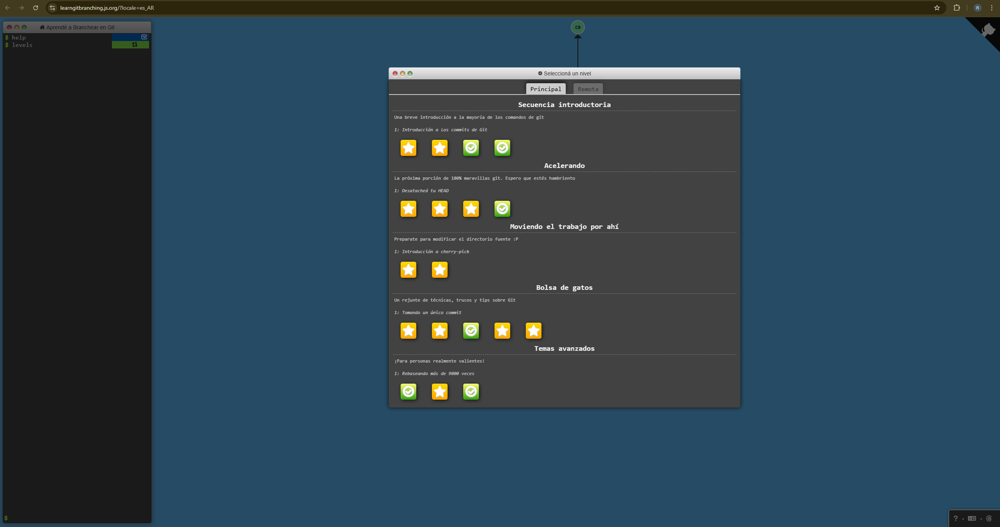
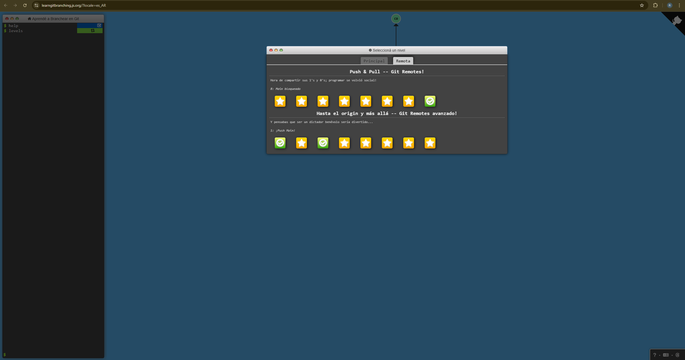
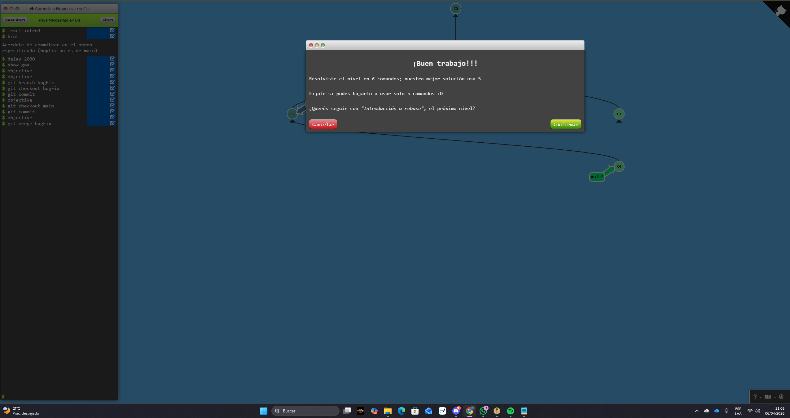
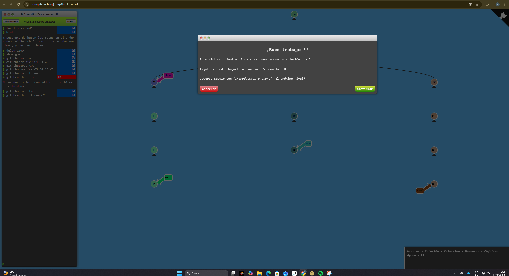
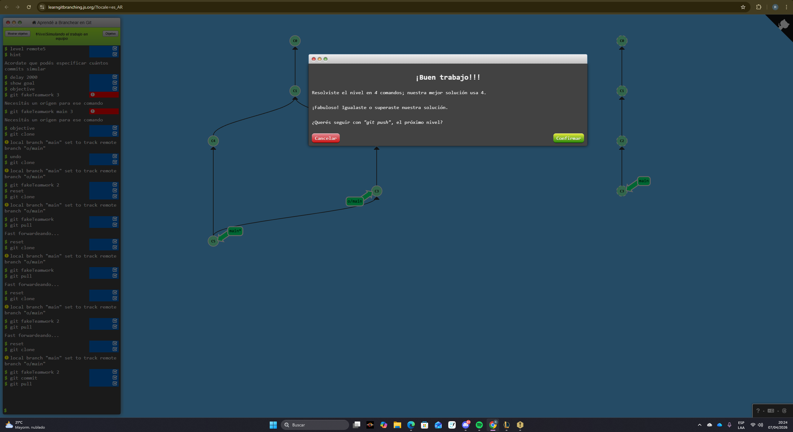

# Laboratorio 1 - Parte 1: Sistemas de control de versiones (Git)

**Estudiante:** Raúl Villalobos Vega - C18555

**Curso:** IE0417 Diseño de Software para Ingeniería  
**Laboratorio:** 1  

---

## Evidencia de niveles completados

Sección del Main:

Sección del Remote:

además añado dos scrrenshots tomados luego de finalizar ciertos niveles

---

---

## Conceptos aprendidos

Durante el desarrollo de la práctica se reforzaron varios conceptos importantes de Git:

### 1. Commit

Un **commit** representa un punto de guardado dentro del historial del proyecto. Permite registrar cambios de manera ordenada y regresar a versiones anteriores cuando sea necesario. Comprendí que hacer commits frecuentes ayuda a mantener trazabilidad y a documentar la evolución del software.

### 2. Branch

Una **branch** o rama permite trabajar cambios de manera aislada sin afectar directamente la rama principal. Esto facilita el desarrollo paralelo de nuevas funciones, pruebas o correcciones.

### 3. Merge

El comando **merge** se utiliza para unir cambios provenientes de dos ramas distintas. Aprendí que esta operación conserva el historial de ambas ramas y resulta útil cuando se quiere integrar trabajo sin reescribir la historia del repositorio.

### 4. Rebase

El **rebase** permite mover o reubicar commits sobre otra base. La principal diferencia que observé con respecto a merge es que reordena el historial para que quede más lineal. Esto puede hacer más clara la historia del proyecto, aunque también requiere mayor cuidado para evitar confusiones. Una de las desventajas más grandes es que se pierde el "historial" de los commits realizados para llegar a la última versión, sin embargo es más cómodo trabajar con un repositorio "lineal".

### 5. Checkout y navegación del historial

La navegación entre commits y ramas permite revisar versiones previas del proyecto, explorar cambios realizados y comprender cómo evoluciona el repositorio con el tiempo.

### 6. HEAD y referencias

La práctica ayudó a entender el papel de **HEAD** como referencia al commit actual o a la ubicación de trabajo activa y que esta puede ser "detached" de la rama principal. Esto fue útil para comprender mejor los cambios de contexto entre ramas y commits.

### 7. Cherry-pick y manejo selectivo de cambios

En algunos ejercicios se observa que Git permite seleccionar commits específicos y trasladarlos a otra rama. Esta capacidad es útil cuando se desea reaprovechar un cambio concreto sin fusionar toda una línea de desarrollo.

---

## Dificultades encontradas

Una de las principales dificultades fue distinguir con claridad cuándo conviene usar **merge** y cuándo **rebase**. Aunque ambas operaciones permiten integrar cambios, su efecto sobre el historial es distinto. También resultó retador seguir mentalmente la posición de **HEAD**, especialmente cuando se trabajaba con varias ramas o cuando el historial dejaba de ser lineal.

Otra dificultad importante fue interpretar cómo ciertos comandos modifican la estructura visual del repositorio. La plataforma ayuda mucho en este sentido, porque muestra de forma gráfica el efecto de cada acción, pero al inicio fue necesario detenerse varias veces para analizar qué estaba ocurriendo antes de ejecutar el siguiente comando.

Otra dificultad aparece al momento de desear incluir los cambios hechos en tu repositorio local, con el repositorio remoto si es que durante el tiempo en que se hicieron los cambios en el local, otras personas actualizaron el repositorio remoto. La técnica que pareció más correcta para trabajar con esto, fue realizar un git pull, es decir un fetch y un merge y luego realizar el push de nuevo al repositorio remoto.

---

## Reflexión final

Git es una herramienta fundamental en proyectos reales porque permite llevar control preciso sobre cada cambio realizado en el código. Esto no solo facilita regresar a versiones anteriores cuando ocurre un error, sino que también mejora el trabajo colaborativo, ya que varias personas pueden desarrollar funciones distintas en paralelo sin sobrescribir el trabajo de otras.

Además, Git aporta orden, trazabilidad y seguridad dentro del proceso de desarrollo. En proyectos pequeños puede parecer una herramienta opcional, pero en proyectos medianos o grandes se vuelve esencial para mantener estabilidad, coordinar equipos y documentar la evolución del software.
