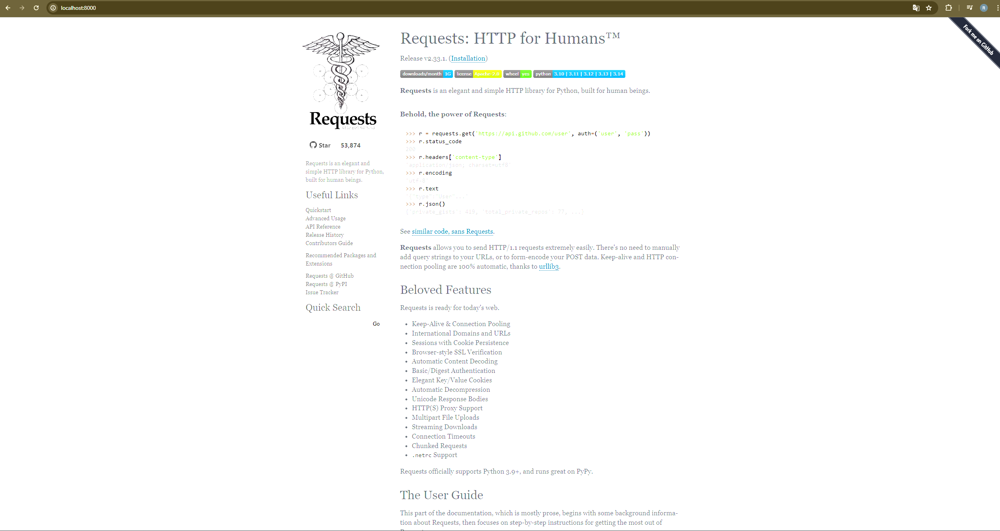
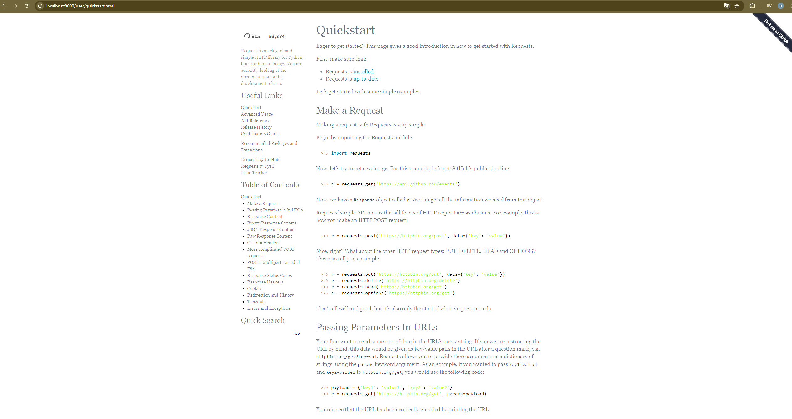
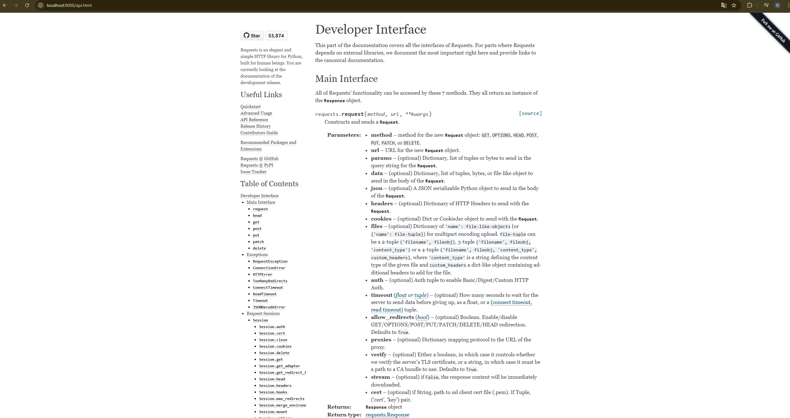

# Laboratorio 1 – Parte 2: Generación de documentación automática

**Estudiante:** Raúl Villalobos Vega - C18555

**Curso:** IE0417 Diseño de Software para Ingeniería  
**Laboratorio:** 1  

---

## Repositorios encontrados

Para generar la documentación se escogieron los siguientes respositorios:

### Repositorio 1
- **Nombre:** Requests
- **URL:** https://github.com/psf/requests
- **Lenguaje principal:** Python
- **Herramienta compatible:** Sphinx

### Repositorio 2
- **Nombre:** TheAlgorithms/C-Plus-Plus
- **URL:** https://github.com/TheAlgorithms/C-Plus-Plus
- **Lenguaje principal:** C++
- **Herramienta compatible:** Doxygen

---

## Repositorio seleccionado

Se seleccionó el repositorio **Requests**, ya que es un proyecto ampliamente reconocido dentro del ecosistema de Python y posee una estructura clara para generar documentación con **Sphinx**. En particular, el repositorio incluye una carpeta `docs/`, un archivo `conf.py`, un `Makefile` dentro de esa carpeta y un archivo `docs/requirements.txt`, lo que permite ejecutar el proceso de construcción de la documentación de forma ordenada.

---

## Herramienta utilizada

La herramienta utilizada fue **Sphinx**.

Sphinx es un generador de documentación que produce sitios HTML a partir de archivos fuente y una configuración del proyecto. En este caso, se utilizó la configuración incluida en la carpeta `docs/` del repositorio de Requests para generar la documentación HTML.

---

## Procedimiento realizado

### Clonación del repositorio

Se clonó el repositorio seleccionado con el siguiente comando:

```bash
git clone https://github.com/psf/requests.git
```


### Ingreso al proyecto

Luego se ingresó al directorio principal del repositorio:

```bash
cd requests
```

### Creación y activación del entorno virtual

Para trabajar de forma aislada, se creó y activó un entorno virtual:

```bash
python3 -m venv .venv
source .venv/bin/activate
```

### Instalación de dependencias para la documentación

Después se instalaron las dependencias necesarias para construir la documentación:

```bash
python -m pip install -r docs/requirements.txt
```

### Ingreso a la carpeta de documentación

A continuación, se ingresó a la carpeta donde se encuentra la configuración de Sphinx:

```bash
cd docs
```

### Generación de la documentación HTML

Finalmente, se ejecutó el comando de construcción:

```bash
make html
```

---

## Resultado obtenido

Al finalizar la ejecución, se generó la carpeta `_build/html/` dentro del directorio `docs/`. En esta carpeta se encuentra el archivo `index.html`, que corresponde a la página principal de la documentación generada.

La salida obtenida incluye archivos HTML, recursos estáticos y páginas enlazadas entre sí, lo que permite navegar la documentación del proyecto de manera estructurada.

Para comprobar el contenido generado, se ingresó a la carpeta correspondiente y se verificó que estuviera presente el archivo principal de la documentación:

```bash
cd _build/html
ls
```

Luego, para visualizar la documentación de forma local desde el navegador, se levantó un servidor HTTP en el puerto 8000 con el siguiente comando:

```bash
python -m http.server 8000
```

Después de eso, se abrió en el navegador la dirección:

```text
http://localhost:8000
```

De esta manera fue posible revisar la página principal y navegar internamente por la documentación generada antes de publicarla.

---

## Verificación de la documentación

Se comprobó que la documentación generada:

- se construyó correctamente;
- contiene una página principal;
- incluye navegación entre secciones;
- presenta contenido del proyecto documentado;
- puede visualizarse localmente en el navegador mediante el puerto 8000;
- puede publicarse como un sitio estático.

Esto confirma que la documentación fue generada correctamente con la herramienta seleccionada y que su contenido puede revisarse antes de ser publicado.

---

## Evidencias







---

## Publicación en Netlify

Una vez creados los html, se extrajo la carpeta html y se utilizó netlify para mostrar una página que siempre contenga el contenido.

**Enlace público de la documentación:**  
https://69d63fa614404db9b014eb21--effervescent-centaur-600ec5.netlify.app/

