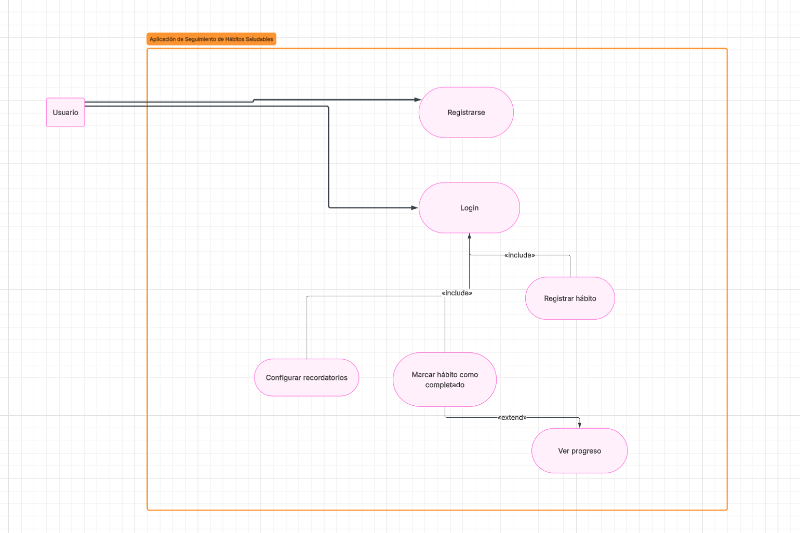

# Tarea 2 - Análisis de requerimientos y modelado de casos de uso
# Raúl Villalobos Vega C18555

## Escenario seleccionado
**App para seguimiento de hábitos saludables**

---

## 1. Lista de requerimientos

### 1.1 Requerimientos funcionales

**01. Registro de usuario**  
El sistema debe permitir que una persona cree una cuenta mediante nombre, correo electrónico y contraseña.

**02. Autenticación de usuario**  
El sistema debe permitir que el usuario inicie sesión con su correo electrónico y contraseña para acceder a sus hábitos y estadísticas.

**03. Gestión de hábitos**  
El sistema debe permitir al usuario crear, editar, pausar y eliminar hábitos saludables, por ejemplo: tomar agua, caminar, dormir 8 horas o hacer ejercicio.

**04. Registro de cumplimiento diario**  
El sistema debe permitir al usuario marcar cada hábito como completado, no completado o parcialmente completado en una fecha determinada.

**05. Consulta de progreso**  
El sistema debe mostrar al usuario su progreso diario, semanal y mensual mediante indicadores como porcentaje de cumplimiento, rachas y metas alcanzadas.

**06. Configuración de recordatorios**  
El sistema debe permitir al usuario configurar recordatorios para cada hábito, incluyendo hora, frecuencia y activación o desactivación de notificaciones.

**07. Definición de metas personales**  
El sistema debe permitir al usuario establecer metas asociadas a sus hábitos, por ejemplo: caminar 8000 pasos al día o beber 2 litros de agua.

**08. Recomendaciones básicas**  
El sistema debe generar recomendaciones básicas a partir del historial de cumplimiento, por ejemplo: sugerir ajustar horarios o reducir la cantidad de hábitos activos cuando el cumplimiento sea bajo.

### 1.2 Requerimientos no funcionales

**01. Rendimiento**  
El sistema debe responder a consultas de progreso y carga de hábitos en menos de 2 segundos en al menos el 95% de las solicitudes normales de uso.

**02. Seguridad**  
El sistema debe proteger las credenciales y datos personales del usuario mediante cifrado en tránsito y almacenamiento seguro de contraseñas.

**03. Disponibilidad**  
El sistema debe estar disponible al menos el 99.5% del tiempo, excluyendo ventanas programadas de mantenimiento.

**04. Usabilidad**  
La interfaz debe ser comprensible para usuarios sin conocimientos técnicos y permitir registrar el cumplimiento de un hábito en no más de 3 acciones principales.

### 1.3 Requerimientos técnicos y de interfaz

**01. Plataforma**  
La solución debe ofrecer una interfaz responsiva orientada a dispositivos móviles Android e iOS.

**01. Integración externa**  
El sistema debe ofrecer una API REST segura sobre HTTPS para permitir la sincronización futura con dispositivos o aplicaciones de salud que intercambien datos en formato JSON.

---

## 2. Casos de uso

### Caso de uso 1: Registrar cumplimiento de hábito

**Precondiciones:**
- El usuario ha iniciado sesión.
- El usuario tiene al menos un hábito activo registrado.
- El sistema se encuentra disponible.

**Postcondiciones:**
- El estado del hábito queda almacenado para la fecha seleccionada.
- El sistema actualiza el progreso del usuario.
- La racha del hábito se recalcula si corresponde.

**Flujo principal:**
1. El usuario accede a la pantalla de hábitos del día.
2. El sistema muestra la lista de hábitos activos y su estado actual.
3. El usuario selecciona un hábito.
4. El usuario marca el hábito como completado, no completado o parcialmente completado.
5. El sistema valida que el registro corresponda a una fecha permitida.
6. El sistema almacena el registro del hábito.
7. El sistema actualiza indicadores como porcentaje de cumplimiento y racha.
8. El sistema muestra un mensaje de confirmación.

**Flujos alternativos:**
- **a. El hábito ya fue registrado en esa fecha:**
  1. El sistema informa que ya existe un registro previo.
  2. El usuario decide si desea editar el registro existente.
  3. El sistema actualiza la información y recalcula el progreso.

- **b. La fecha ingresada no es válida:**
  1. El sistema muestra un mensaje de error.
  2. El usuario corrige la fecha o cancela la operación.

- **c. Ocurre un error al guardar la información:**
  1. El sistema informa que no fue posible completar el registro.
  2. El usuario puede intentar nuevamente.

### Caso de uso 2: Consultar progreso semanal

**Precondiciones:**
- El usuario ha iniciado sesión.
- Existen hábitos creados por el usuario.
- El sistema puede acceder al historial de registros del usuario.

**Postcondiciones:**
- El usuario visualiza su progreso semanal actualizado.
- El sistema deja disponible un resumen con métricas del periodo consultado.

**Flujo principal:**
1. El usuario accede a la sección de progreso.
2. El sistema muestra las opciones de consulta disponibles.
3. El usuario selecciona la vista semanal.
4. El sistema recupera los registros correspondientes a la semana elegida.
5. El sistema calcula métricas como porcentaje de cumplimiento, rachas activas y metas alcanzadas.
6. El sistema presenta gráficos e indicadores resumidos.
7. El usuario revisa la información mostrada.

**Flujos alternativos:**
- **a. No existen registros en la semana seleccionada:**
  1. El sistema muestra un estado vacío.
  2. El sistema sugiere registrar hábitos para comenzar a generar estadísticas.

- **b. Existen datos incompletos o inconsistentes:**
  1. El sistema muestra la información disponible.
  2. El sistema advierte que algunos indicadores podrían estar incompletos.

- **c. El usuario solicita otra semana:**
  1. El usuario cambia el periodo de consulta.
  2. El sistema repite el proceso de recuperación y cálculo para el nuevo intervalo.

---

## 3. Diagrama UML de casos de uso

